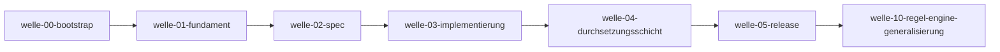

# Roadmap

**Status:** Aktiv. **Letzte Änderung:** 2026-07-01.

**Format-Regel:** Die Roadmap ist eine Reihenfolge von **Wellen**, keine
Reihenfolge von Terminen. Termine erscheinen — falls überhaupt — als
Konsequenz der Wellen-Schätzung, nicht als Treiber. Die Roadmap steht
außerhalb der normativen Klammer: sie *orchestriert* Slices und Wellen,
erzeugt aber keine Spezifikation (Regelwerk Modul 6).

> **Hinweis zur Slice-Buchführung.** Die abgeschlossenen Slices liegen als
> Planning-Harness-Dateien unter `done/` (retroaktiv nachgezogen, Regelwerk
> Modul 5) mit Closure-Notiz + Lerneintrag; ab `slice-004` entstehen sie
> regulär über den Lifecycle (`open → next → in-progress → done`).

---

## Aktuelle Welle

**`welle-10-regel-engine-generalisierung` abgeschlossen — alle Inkremente a, b1, b2a
(in `v0.2.0` veröffentlicht) und b2b (slice-012, Lastenheft 0.6.0, noch unveröffentlicht)
gemergt.** Die Reinheits-Regeln
dispatchen nicht mehr über Layer-**Namen**, sondern über eine Layer-**Rolle**, und das
Modell ist auf vier Schichten ausgebaut:

- **a** ([slice-009](../done/slice-009-rollen-dispatch.md), [ADR-0009](../../adr/0009-rollen-basierter-regel-dispatch.md) `Accepted`, [AC-FA-RULE-006](../../../../spec/lastenheft.md#ac-fa-rule-006--schicht-rollen-generische-regel-anwendung)): Rollen-Dispatch {`domain`, `port`, `adapter`} + Namens-Inferenz, rückwärtskompatibel.
- **b1** ([slice-010](../done/slice-010-adapterseg-targetlayer.md), [ADR-0010](../../adr/0010-layer-relativer-adapterseg-laengster-praefix.md) `Accepted`): `adapterSeg` layer-relativ + `targetLayer` längster-Präfix, segment-bewusst.
- **b2a** ([slice-011](../done/slice-011-app-rolle.md), [ADR-0011](../../adr/0011-domain-application-trennung-rolle-app.md) `Accepted`, [AC-FA-RULE-007](../../../../spec/lastenheft.md#ac-fa-rule-007--rolle-app-und-strenge-domain)): Rolle `app` (→ Befund `app-impurity`) + strenge `domain` (`domain↛port` kategorisch). Lastenheft/Spezifikation **0.5.0**.
- **b2b** ([slice-012](../done/slice-012-driving-driven-layerof.md), [ADR-0012](../../adr/0012-driving-driven-richtung-orthogonale-dimension.md)/[ADR-0013](../../adr/0013-layerof-laengster-praefix.md) `Accepted`, [AC-FA-RULE-008](../../../../spec/lastenheft.md#ac-fa-rule-008--driving-driven-port-richtung-regel-port-direction-mismatch)): optionale Richtung `direction` (`driving`/`driven`, orthogonal zur Rolle) + Regel `port-direction-mismatch` (kategorisch); `LayerOf` längster-literaler-Präfix (Angleichung an `targetLayer`). Lastenheft/Spezifikation **0.6.0**.

**Carry-forward (b2b):** Die Richtung ist *opt-in und inert ohne `direction`* —
mindestens ein Konsument (b-cad/d-check/d-migrate) soll getrennte `driving`/`driven`-
Adapter- **und** -Port-Schichten real aktivieren, sonst bleibt Teil A geliefert-aber-
ungenutzt. Port→Port-Richtungsregeln und Auto-Inferenz der Richtung bleiben out-of-scope
(späteres Inkrement).
Alle Gates real und grün (`make gates`; Dogfooding 0 Befunde).

**Parallel offen — `welle-05-release`:** `v0.1.0`, `v0.2.0` und **`v0.3.0`** sind veröffentlicht
([slice-007 §4](../done/slice-007-release-pipeline.md#4-closure-notiz-nach-done),
[ADR-0007](../../adr/0007-latest-tag-politik.md) `Accepted`; GHCR
`@sha256:93be49a6…` (aktuell v0.3.0) digest-gepinnt in `a-check.mk`); nur die
**Pilot-Einbindung** in ein Konsumenten-Repo bleibt. Für den b-cad-Pilot liefert
[slice-016](../done/slice-016-regex-tech-muster.md) ([ADR-0015](../../adr/0015-regex-tech-muster.md),
Lastenheft/Spezifikation 0.8.0) die letzte fehlende a-check-Fähigkeit — `tech`-Muster als opt-in
RE2-Regex (`match: regex`), womit arch-check.shs Qt-**Regel E** (`Q[A-Za-z]`) ausdrückbar und
`arch-check.sh` **vollständig** ersetzbar wird; der eigentliche Ersatz in b-cad folgt nach einem
neuen Release + Digest-Re-Pin. Als Release-Hygiene ist [slice-018](../open/slice-018-versions-register-pin-gate.md)
vorgemerkt (Versions-Register `version.md` + `versions`/`pins`-Gate), nachdem ein stale README-Pin
nur per Zufalls-Audit auffiel.

## Nächste Wellen

| Welle | Trigger | Wichtigste Inhalte | Status |
|---|---|---|---|
| welle-05-release | Image-Veröffentlichung | **`v0.1.0` veröffentlicht** ([slice-007](../done/slice-007-release-pipeline.md): `release.yml` + [ADR-0007](../../adr/0007-latest-tag-politik.md)); GHCR digest-gepinnt in `a-check.mk` ([AC-FA-DIST-001](../../../../spec/lastenheft.md#ac-fa-dist-001--distribution-image---print-mk-a-checkmk), [AC-QA-03](../../../../spec/lastenheft.md#ac-qa-03--reproduzierbarkeit)). **Offen:** Pilot-Einbindung in ein Konsumenten-Repo | fast fertig |
| welle-06-sprach-backends | Konsumenten-Bedarf (Java/belief-agent) | **Java-Backend** geliefert ([slice-014](../done/slice-014-java-backend.md), [AC-FA-EXTRACT-001](../../../../spec/lastenheft.md#ac-fa-extract-001--sprach-backends-für-die-import-extraktion) 0.7.0; fünftes Backend). **Offene Kandidaten** aus dem Polyglot-Bestand: **Python** / **C#** / **TypeScript** — je Extraktions-Backend (billig) **plus** ein Auflösungs-Modus (siehe Resolution-Zeile). **Maintainer-Priorität:** Kern **Go + C++** (bereits unterstützt, solide halten) → dann **Python/C#/TypeScript** (neue Backends) → **Rust** nachrangig (unterstützt, kein weiterer Ausbau). Härtung: [slice-017](../open/slice-017-unbekannte-sprache-exit2.md) — unbekannter `languages`-Schlüssel bricht heute **still** durch (falsch-grün) → Exit 2. | läuft |
| driving/driven-Vertiefung | Konsumenten-Bedarf (Gate) | Port→Port-Richtungsregeln + Auto-Inferenz der Richtung aus **Namen** (Glob/Pfad bleibt out) ([ADR-0012](../../adr/0012-driving-driven-richtung-orthogonale-dimension.md) Out-of-Scope); Entwurf [slice-013](../open/slice-013-driving-driven-vertiefung.md) — Carry-forward aus welle-10b/b2b; x-wal als Struktur-Kandidat | Entwurf in Abnahme |
| Import-Auflösung (Resolution-Roots, **sprach-parametrisch**) | Konsument mit Import-Form ≠ „Pfad = Scan-Wurzel-relativ" (nicht mehr JVM-only) | [ADR-0014](../../adr/0014-resolution-roots.md) (Re-Eval von [ADR-0002](../../adr/0002-text-heuristische-extraktion.md)): Import gegen konfigurierbare Resolution-Roots (dotted-aware), Build-Manifest als optionaler Hinweis; Entwurf [slice-015](../open/slice-015-resolution-roots.md). **Drei Auflösungs-Modi:** fester-Wurzel-dotted (Go ✓/JVM/Python/C++-`src`, der bereits entschiedene Modus) · relativ-zum-File (TypeScript, quoted C++) · Namespace-Index (C#) — die letzten beiden vermutlich je Folge-ADR. **Evidenz:** b-cad (C++ Scan-Wurzel = Include-Root) + x-wal (JVM) + Polyglot-Bestand | offen (gated) |

_(Kein fixer Termin — Wellen feuern auf Trigger.)_

## Meilensteine

| Meilenstein | Welle(n) | Status |
|---|---|---|
| M1: Spec-Fundament steht (Lastenheft + Spezifikation + Architektur + Fundament-ADRs) | welle-01/02 | **erreicht** (2026-06-21) |
| M2: Dogfooding — a-check prüft die eigene Architektur grün ([AC-QA-02](../../../../spec/lastenheft.md#ac-qa-02--hermetik-und-ehrliche-heuristik-grenze)) | welle-03 | **erreicht** (2026-06-21) |
| M3: erstes GHCR-Release + Pilot-Einbindung | welle-05 | offen |

## Abhängigkeitsgraph

## Abgeschlossene Wellen

| Welle | Abschluss | Closure-Beleg |
|---|---|---|
| welle-00-bootstrap | 2026-06-20 | Harness-Trias + Lastenheft 0.1.0 + Doku-Gate `make doc-check` ([CHANGELOG](../../../../CHANGELOG.md)) |
| welle-01-fundament | 2026-06-21 | [slice-001 §7](../done/slice-001-fundament-adrs.md#7-closure-notiz-nach-done) — Fundament-ADRs [ADR-0001](../../adr/0001-go-impl-sprache.md)…[ADR-0004](../../adr/0004-distribution-image-mk.md) `Accepted` |
| welle-02-spec | 2026-06-21 | [slice-002 §7](../done/slice-002-architektur-spezifikation.md#7-closure-notiz-nach-done) — Technik-/Sicht-Stratum (`SPEC-*`/`ARC-*`) |
| welle-03-implementierung | 2026-06-21 | [slice-003 §7](../done/slice-003-implementierung-gates.md#7-closure-notiz-nach-done) — Go-Implementierung + Gates; [ADR-0005](../../adr/0005-lint-profil.md)/[ADR-0006](../../adr/0006-coverage-gate.md) `Accepted` |
| welle-04-durchsetzungsschicht | 2026-06-21 | [slice-004 §4](../done/slice-004-durchsetzungsschicht.md#4-closure-notiz-nach-done) — Meta-Gates `gate-consistency`/`record-gates` + `.claude`-Stop-Hook |
| welle-07-command-guard | 2026-06-21 | [slice-005 §4](../done/slice-005-command-guard.md#4-closure-notiz-nach-done) — PreToolUse-Command-Guard (Tool-Call-Gate); Durchsetzungsschicht vollständig |
| welle-08-ci | 2026-06-21 | [slice-006 §4](../done/slice-006-ci-pipeline.md#4-closure-notiz-nach-done) — PR-/Push-CI (`ci.yml`): `make ci` (+ `image-test`) + `make trace-check`; Dockerfile-OCI-Labels |
| welle-09-commit-hook | 2026-06-21 | [slice-008 §4](../done/slice-008-commit-msg-hook.md#4-closure-notiz-nach-done) — lokaler `commit-msg`-Hook (`.githooks` + `make hooks`) |
| welle-10-regel-engine-generalisierung | 2026-06-23 | [slice-012 §7](../done/slice-012-driving-driven-layerof.md) — Rollen-Dispatch + 4-Schichten-Modell + `driving`/`driven`-Richtung + `LayerOf` längster-literaler-Präfix; [ADR-0009](../../adr/0009-rollen-basierter-regel-dispatch.md)…[ADR-0013](../../adr/0013-layerof-laengster-praefix.md) `Accepted`. Carry-forward: [slice-013](../open/slice-013-driving-driven-vertiefung.md) |
