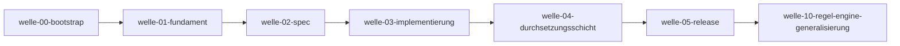

# Roadmap

**Status:** Aktiv. **Letzte Änderung:** 2026-08-09.

> **Was hier steht — und was nicht.** Diese Roadmap ist eine Reihenfolge von **Wellen**, kein
> Statusbericht über Slices (`modul-06`: *„nicht ‚wann?', sondern ‚in welcher Reihenfolge
> wovon?'"*). Was ein einzelner Slice geliefert und gelernt hat, steht in **seiner Closure-Notiz**
> unter `done/` — hier wird darauf verwiesen, nicht wiederholt. Bis slice-067 taten das zwei
> gewachsene Status-Blöcke (~174 Zeilen), die von den Notizen wegdrifteten; sie sind entfernt.

## Aktuelle Welle

**`welle-12-regelwerk-migration` — wieder offen.** Sie stand vom 2026-07-26 bis zum 2026-08-09 im
Closure-Log. Der erste unabhängige Review
([Report](../../../reviews/2026-08-09-welle-12-unabhaengig.md)) hat ihr Closure-Kriterium
widerlegt; die Closure ist zurückgezogen. Das ist Modul-6-Ausgang **(b)** — Welle offen lassen,
Verschiebung im Drift-Log ausweisen — und nicht Ausgang (a), unter dem sie bis heute stand: „Welle
trotzdem schließen → der Audit fällt durch, weil Slices unbelegt sind."

**Slice-IDs.** Der Bestand der Etappen A–F ist die Spanne
[slice-046](../open/slice-046-regelwerk-v352-migration-analyse.md) …
[slice-067](../done/slice-067-roadmap-form.md); was jeder einzelne geliefert und gelernt hat, steht
in seiner Closure-Notiz unter `done/`. Alle liegen dort — mit einer Ausnahme:
[slice-046](../open/slice-046-regelwerk-v352-migration-analyse.md) liegt weiterhin in `open/` und
trägt eine offene Abnahme, während das bisherige Closure-Log „alle Slices in `done/`" behauptete.
Für die 15 Review-Findings ist **Gruppe A** geschnitten — nach Fehlermechanismus, ein Mechanismus
je Slice: [slice-068](../done/slice-068-phony-vollstaendig.md) (Target läuft gar nicht) ·
[slice-069](../done/slice-069-sensor-fehler-propagierung.md) (Sensor verschluckt einen Fehler) ·
[slice-070](../done/slice-070-grundgesamtheit-messen.md) („nichts gefunden" ≠ „nichts da") ·
[slice-071](../done/slice-071-sensor-scope-vollstaendig.md) (nur ein Teil des Bestands gemessen).
Ein erster Sammel-Entwurf über alle fünf Funde wurde nach einem unabhängigen **Plan**-Review
([Report](../../../reviews/2026-08-09-slice-068-plan-review.md), 4 HIGH) zurückgezogen und zerlegt;
dabei kamen zwei weitere False-Greens hinzu. `slice-068` und `slice-069` liegen in `done/`.
Aus der Arbeit an ihnen kam [slice-072](../open/slice-072-scope-sensor-praeventiv.md) hinzu — kein
False-Green, sondern ein Sensor, der erst nach dem Push greift; der Auslöser war ein realer roter
CI-Lauf. Die Gruppen **B**, **C** und **D** sind **noch nicht geschnitten** — solange sie fehlen,
ist die Slice-Liste dieser Welle unvollständig.

**Trigger (beobachtbar).** Die Welle schließt, wenn alle ihre Slices in `done/` liegen —
[slice-046](../open/slice-046-regelwerk-v352-migration-analyse.md) eingeschlossen —, jedes im
Report belegte False-Green behoben ist **und je Behebung eine Gegenprobe existiert, die vorher rot
war**, und `make ci` grün läuft. Ein Sensor, der nach der Korrektur grün meldet, ohne dass jemand
ihn rot gesehen hat, belegt nichts — das ist die Lehre des Reports.

**Closure-Kriterien.** Die Fünf-Schritt-Prozedur aus [`planning/README.md`](../README.md) mit allen
fünf Belegen, einschließlich `done/welle-12-results.md`. Die Grandfather-Klausel dort nennt
namentlich `welle-00` … `welle-11`; `welle-12` ist nicht darunter und damit die erste Welle, für
die die Prozedur gilt. Ihr Abschluss ist zugleich deren Probe — die bis hierher zweimal
verschoben wurde.

## Nächste Wellen

| Welle | Trigger (beobachtbar) | Wichtigste Slices | Aufwand |
|---|---|---|---|
| driving/driven-Vertiefung (Teil A) | ein Konsument mit Richtungs-**Namen**, die die Grammatik treffen, **plus** geklärte Verhaltens-Neutralität | [slice-013](../open/slice-013-driving-driven-vertiefung.md) | M |
| Namespace-Auflösung (C#) | ein C#-Konsument, dessen Namespace ≠ Verzeichnis ist | Folge-ADR + Backend-Slice | M |
| Ziel-seitige Abdeckung | eine der drei Bedingungen aus [slice-045 §0](../open/slice-045-intern-extern-dateimenge.md) tritt ein | [slice-045](../open/slice-045-intern-extern-dateimenge.md) | M |

_(Kein fixer Termin — Wellen feuern auf Trigger. Abgeschlossene Wellen stehen ausschließlich im
Closure-Log.)_

## Meilensteine

| Meilenstein | Welle(n) | Status |
|---|---|---|
| M1: Spec-Fundament steht (Lastenheft + Spezifikation + Architektur + Fundament-ADRs) | welle-01/02 | **erreicht** (2026-06-21) |
| M2: Dogfooding — a-check prüft die eigene Architektur grün ([AC-QA-02](../../../../spec/lastenheft.md#ac-qa-02--hermetik-und-ehrliche-heuristik-grenze)) | welle-03 | **erreicht** (2026-06-21) |
| M3: erstes GHCR-Release + Pilot-Einbindung | welle-05 | **erreicht** (2026-07-05) — v0.1.0…v0.11.0 released; **zwei reale Konsumenten**: b-cad (C++, `.a-check.yml` + `a-check.mk`@v0.9.0 + `arch-check.sh` auf 75-Zeilen-P-Rest, 2026-07-04) und belief-agent (Kotlin/KMP, v0.11.0 adoptiert + Erfolg gemeldet 2026-07-05) |

## Abhängigkeitsgraph

```mermaid
flowchart LR
    W0[welle-00-bootstrap]
    W1[welle-01-fundament]
    W2[welle-02-spec]
    W3[welle-03-implementierung]
    W4[welle-04-durchsetzungsschicht]
    W5[welle-05-release]
    W10[welle-10-regel-engine-generalisierung]

    W0 --> W1 --> W2 --> W3 --> W4 --> W5 --> W10
```

## Abgeschlossene Wellen

| Welle | Abschluss | Closure-Beleg |
|---|---|---|
| welle-00-bootstrap | 2026-06-20 | Harness-Trias + Lastenheft 0.1.0 + Doku-Gate `make doc-check` ([CHANGELOG](../../../../CHANGELOG.md)) |
| welle-01-fundament | 2026-06-21 | [slice-001 §7](../done/slice-001-fundament-adrs.md#7-closure-notiz-nach-done) — Fundament-ADRs [ADR-0001](../../adr/0001-go-impl-sprache.md)…[ADR-0004](../../adr/0004-distribution-image-mk.md) `Accepted` |
| welle-02-spec | 2026-06-21 | [slice-002 §7](../done/slice-002-architektur-spezifikation.md#7-closure-notiz-nach-done) — Technik-/Sicht-Stratum (`SPEC-*`/`ARC-*`) |
| welle-03-implementierung | 2026-06-21 | [slice-003 §7](../done/slice-003-implementierung-gates.md#7-closure-notiz-nach-done) — Go-Implementierung + Gates; [ADR-0005](../../adr/0005-lint-profil.md)/[ADR-0006](../../adr/0006-coverage-gate.md) `Accepted` |
| welle-04-durchsetzungsschicht | 2026-06-21 | [slice-004 §4](../done/slice-004-durchsetzungsschicht.md#4-closure-notiz-nach-done) — Meta-Gates `gate-consistency`/`record-gates` + `.claude`-Stop-Hook |
| welle-07-command-guard | 2026-06-21 | [slice-005 §4](../done/slice-005-command-guard.md#4-closure-notiz-nach-done) — PreToolUse-Command-Guard (Tool-Call-Gate); Durchsetzungsschicht vollständig |
| welle-08-ci | 2026-06-21 | [slice-006 §4](../done/slice-006-ci-pipeline.md#4-closure-notiz-nach-done) — PR-/Push-CI (`ci.yml`): `make ci` (+ `image-test`) + `make trace-check`; Dockerfile-OCI-Labels |
| welle-09-commit-hook | 2026-06-21 | [slice-008 §4](../done/slice-008-commit-msg-hook.md#4-closure-notiz-nach-done) — lokaler `commit-msg`-Hook (`.githooks` + `make hooks`) |
| welle-10-regel-engine-generalisierung | 2026-06-23 | [slice-012 §7](../done/slice-012-driving-driven-layerof.md) — Rollen-Dispatch + 4-Schichten-Modell + `driving`/`driven`-Richtung + `LayerOf` längster-literaler-Präfix; [ADR-0009](../../adr/0009-rollen-basierter-regel-dispatch.md)…[ADR-0013](../../adr/0013-layerof-laengster-praefix.md) `Accepted`. Carry-forward: [slice-013](../open/slice-013-driving-driven-vertiefung.md) |
| welle-06-sprach-backends | 2026-07-03 | [slice-022 §8](../done/slice-022-typescript-backend.md#8-closure-notiz) — vier Backends geliefert: Java ([slice-014](../done/slice-014-java-backend.md)), Python ([slice-020](../done/slice-020-python-backend.md)), C# ([slice-021](../done/slice-021-csharp-backend.md)), TypeScript ([slice-022](../done/slice-022-typescript-backend.md)); Auflösung `fixed-root` ([ADR-0016](../../adr/0016-resolution-sprach-parametrisch.md)) + `relative` ([ADR-0017](../../adr/0017-relative-resolution-modus.md)); `namespace` bleibt reserviert (Folge-Slice bei realem Pilot) |
| welle-11-dcheck-pilot-deltas | 2026-07-03 | [slice-023 §4](../done/slice-023-dcheck-pilot-deltas.md#4-closure-notiz) — `tech.adapter`-Liste + `composition_root: allow\|forbid` + `exclude` ([ADR-0018](../../adr/0018-exclude-scan-scope.md) `Accepted`, Lastenheft/Spez 0.14.0), veröffentlicht in `v0.8.0` — d-check-Umstellung entsperrt |

## Historische Trigger-Verschiebungen

Das **Drift-Log** (Regelwerk Modul 6, fünfter Pflicht-Abschnitt; nachgetragen in slice-053, Fund
B-12). Neben dem Closure-Log oben macht es die Vergangenheit der Roadmap auditierbar: dort steht,
*was* geschlossen wurde, hier *was sich unterwegs verschoben hat*. Eine Roadmap ohne diese Tabelle
sieht im Rückblick aus, als wäre sie immer so geplant gewesen.

Aufgenommen sind nur Verschiebungen, die im Repo **belegt** sind (Slice-Dokument, ADR oder
Roadmap-Text). Ältere Umplanungen ohne Beleg werden nicht rekonstruiert — ein erfundenes Drift-Log
wäre schlimmer als keines.

| Datum | Änderung | Grund | Beleg |
|---|---|---|---|
| 2026-07-05 | [ADR-0020](../../adr/0020-mehr-wurzel-phantom-guard.md) → `Superseded` durch [ADR-0022](../../adr/0022-datei-mengen-bewusste-mehr-wurzel-aufloesung.md) | der Phantom-Guard unterdrückte das Symptom, ohne die Ursache zu treffen — die Auflösung war wurzel-, nicht datei-mengen-bewusst | [slice-026 §8](../done/slice-026-kmp-mehr-root-phantom.md), [slice-027 §9](../done/slice-027-kmp-multimodul-resolution.md) |
| 2026-07-25 | [slice-013](../open/slice-013-driving-driven-vertiefung.md) Teil B (Port→Port) **verworfen**, Teil A (Auto-Inferenz) **vertagt** | Messung: null reale Fundstellen im Bestand; die Evidenz für Teil B beruhte auf einem Mess-Fehler (Pfad-Präfix statt Kante) | [slice-013 §0](../open/slice-013-driving-driven-vertiefung.md) |
| 2026-07-25 | Kandidat **2b** (Präfix-Allowlist) **erodiert** — bleibt gated, ohne Folge-Slice | b-cads P2 zerfällt in Kanten + Abdeckungs-Diagnose + Compiler; keiner der drei braucht die Beweislast-Umkehr | [slice-045 §5.1](../open/slice-045-intern-extern-dateimenge.md) |
| 2026-07-25 | `strict_coverage` aus [slice-043](../done/slice-043-schicht-abdeckung-sichtbar.md) **vertagt** | die advisory Diagnose reicht für den belegten Bedarf; die harte Variante braucht erst einen Trigger | [ADR-0029](../../adr/0029-abdeckungs-diagnose-advisory.md) |
| 2026-07-25 | [slice-045](../open/slice-045-intern-extern-dateimenge.md) **entschieden: jetzt nicht bauen** | null reale Fundstellen, erodierte Nachfrage, und a-check könnte den `fixed-root`-only-Mechanismus im eigenen `path`-Modus nicht dogfooden | [slice-045 §0](../open/slice-045-intern-extern-dateimenge.md) |
| 2026-07-25 | Regelwerk-Migration: Etappen wachsen von **vier** auf **sechs** (A · B · C · D · **E** · **F**), Reihenfolge **E vor D** | die vollständige Baseline-Lektüre brachte elf zusätzliche Funde; die Mechanik-Funde schaffen die Sensoren, an denen die Form-Funde hängen | [slice-048 §5](../done/slice-048-modul-delta-lesen.md) |
| 2026-07-25 | `nolintlint` als geplante Umsetzung von B-11 **verworfen**, Ersatz `make suppression-check` | Negativ-Probe: der Linter prüft Wohlgeformtheit, nicht Existenz — ein wohlgeformtes `//nolint` ließ `make lint` grün | [slice-049 §1.1](../done/slice-049-mechanik-sensoren.md) |
| 2026-08-09 | `welle-12-regelwerk-migration`: **Closure zurückgezogen**, Welle zurück nach *Aktuelle Welle*. Zugleich verlässt die Zeile „unabhängiges Review der Migration" *Nächste Wellen* — ihr Trigger ist gefeuert | Der erste Review außerhalb der Claude-Modellfamilie widerlegte das Closure-Kriterium „alle Slices in `done/`": [slice-046](../open/slice-046-regelwerk-v352-migration-analyse.md) liegt weiterhin in `open/`. Dazu 11 HIGH — darunter fünf Sensoren, die falsch-grün melden, und die Selbst-Ausnahme von der eigenen Closure-Prozedur. Damit gilt Modul-6-Ausgang **(b)** statt des bisherigen **(a)** („der Audit fällt durch") | [Review-Report 2026-08-09](../../../reviews/2026-08-09-welle-12-unabhaengig.md) |

**Format-Regel:** Die Roadmap ist eine Reihenfolge von **Wellen**, keine
Reihenfolge von Terminen. Termine erscheinen — falls überhaupt — als
Konsequenz der Wellen-Schätzung, nicht als Treiber. Die Roadmap steht
außerhalb der normativen Klammer: sie *orchestriert* Slices und Wellen,
erzeugt aber keine Spezifikation (Regelwerk Modul 6).

> **Hinweis zur Slice-Buchführung.** Die abgeschlossenen Slices liegen als
> Planning-Harness-Dateien unter `done/` (retroaktiv nachgezogen, Regelwerk
> Modul 5) mit Closure-Notiz + Lerneintrag; ab `slice-004` entstehen sie
> regulär über den Lifecycle (`open → next → in-progress → done`).

---
