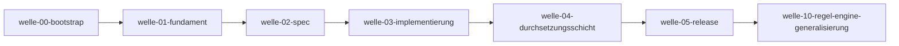

# Roadmap

**Status:** Aktiv. **Letzte Änderung:** 2026-07-25.

> **Wiedereinstieg (Stand 2026-07-25).** [slice-042](../done/slice-042-constructs-aufruf-monopol.md)
> ist **done und gemergt**: `constructs`-Roh-Text-Monopol mit der Regel `construct-leak` —
> Lastenheft **0.22.0**
> ([AC-FA-RULE-011](../../../../spec/lastenheft.md#ac-fa-rule-011--konstrukt-monopol-regel-construct-leak)),
> [ADR-0027](../../adr/0027-constructs-roh-text-monopol.md) `Accepted`, Spezifikation **0.24.0**,
> Handbuch 1.33; `make ci` grün, Paritäts- und Fitness-Probe gegen den realen b-cad-Baum bestanden
> (Pre-Merge-Review-Fund F-1: die Kommentar-Ausnahme gilt für Python nicht — ausgewiesen statt
> gefixt), alle vier lokalen Konsumenten unverändert 0 Befunde.
> Auch [slice-025](../done/slice-025-p-rest-generalisierung.md) ist **done** — der Sammel-Slice hat
> seine Kandidaten verteilt (1 → slice-042, 2a → slice-043, 2b bleibt gated).
> **Nächster Schritt:** ein **Release**, das die Regel ausliefert — erst dann kann b-cad seine
> P1-`grep`-Regel zurückbauen ([slice-042 §10.4](../done/slice-042-constructs-aufruf-monopol.md));
> `[Unreleased]` trägt den Eintrag.
> **Auch neu (2026-07-25):** [slice-044](../done/slice-044-ziel-glob-schattenwurf.md) — ein Layer-Glob mit
> Wildcard **in der Mitte** löst als Import-**Ziel** nicht auf und ließ den Kandidaten bisher auf die
> **umschließende** Schicht zurückfallen; das erzeugte einen `wrong-direction`-**Fehlbefund** auf eine
> deklarierte `adapter → ports`-Kante. Jetzt wird die Zuordnung zurückgezogen (Ziel = extern,
> fail-open, [ADR-0028](../../adr/0028-ziel-glob-schattenwurf.md), Spez **0.25.0**, Handbuch 1.34).
> Damit ist **Option A′** aus [slice-037](../done/slice-037-hexslice-gap-analyse.md) erledigt und
> dieser Analyse-Slice vollständig entschieden — beide sind **done**
> ([slice-037 §10](../done/slice-037-hexslice-gap-analyse.md) hält fest, wohin jede Option
> gegangen ist).
> **Auch neu (2026-07-25):** [slice-043](../done/slice-043-schicht-abdeckung-sichtbar.md) — **done**: die Abdeckungs-Diagnose weist gescannte Dateien ohne Schicht auf stderr aus (advisory, kein Exit-Code-Wechsel, [ADR-0029](../../adr/0029-abdeckungs-diagnose-advisory.md), Spez **0.26.0**, Handbuch 1.35); `strict_coverage` bleibt vertagt (Trigger in der ADR). Die Nachmessung dazu
> korrigierte die Evidenz: real ist **ein** Konsument mit **zwei** Dateien, nicht zwei Konsumenten
> mit Teilbäumen.
> **Neu als Entwurf (2026-07-25):** [slice-045](../open/slice-045-intern-extern-dateimenge.md) —
> die **Ziel**-seitige Abdeckung über die gescannte Dateimenge. Messung: für `fixed-root`-Konsumenten
> trennt der bestehende `fileIndex` intern/extern **fehlerfrei** (b-cad: 87 von 87 korrekt als extern),
> für die vier `path`-Konsumenten nicht ohne Zusatz-Heuristik (Modul-Präfix).
> **Entschieden: jetzt nicht bauen** ([slice-045 §0](../open/slice-045-intern-extern-dateimenge.md)) —
> null reale Fundstellen, die Nachfrage (P2/2b) ist erodiert, und a-check könnte den
> `fixed-root`-only-Mechanismus im eigenen `path`-Modus **nicht dogfooden**. Drei Trigger drehen die
> Entscheidung um; ein `module_base`-Schlüssel ist abgelehnt (zweite Quelle für eine Wahrheit, die
> `segIndex` schon löst).
> **Neu als Analyse (2026-07-25):** [slice-046](../open/slice-046-regelwerk-v352-migration-analyse.md) — Regelwerk-Migration **v1.3.0 → v3.5.2** (Maintainer-Vorgabe: vollständig migrieren, auch gegen bestehende `MR-*`; erst analysieren). Gemessen: alle 21 Regelwerk-Dateien geändert (+705/−1868), drei Brocken — **Vendoring-Modell** (`.harness/baseline/<tag>/`), **[MR-003](../../../../harness/conventions.md#mr-003--source-precedence-ohne-docsuser-rang)-Nummern-Kollision** mit dem Template, **Template-Abgleich** über 21 Vorlagen. Entwarnung: Modul 10 (Review-Kategorien) ist unverändert. Vier Etappen vorgeschlagen, Abnahme offen.
> **Auch neu (2026-07-25):** [slice-047](../done/slice-047-baseline-vendoring.md) — **done**, **Etappe A** der Migration: die
> Baseline liegt jetzt **committet vendored** unter `.harness/baseline/v3.5.2/` (43 Dateien +
> `SHA256SUMS`), die drei Pin-Stellen sind umgestellt, die Adaption ist als
> [MR-006](../../../../harness/conventions.md#mr-006--baseline-committet-vendored-statt-per-url-referenziert)
> deklariert. Ein **unabhängiges Zweit-Review** hat sechs MEDIUM gefunden (u. a. `v1.3.0`-Reste in
> `reviewer.md`/`.d-check.yml`, eine widersprüchliche Dateizahl-Evidenz und eine
> Freshness-Audit-Zuordnung, die Modul 02 ausschließt) — alle vor dem Merge abgearbeitet.
>
> **Abgeschlossen (2026-07-25):** [slice-048](../done/slice-048-modul-delta-lesen.md) — **Etappe B**:
> die vendored Baseline gegenlesen und die Treffer als Findings sammeln. Reine Lesearbeit, kein
> Vertrag berührt. Auf Maintainer-Hinweis („komplett nach v3.5.2 migrieren") vom Sechs-Modul-Zuschnitt
> auf **alle 17 Module + drei Grundlagen-Abschnitte** (2867 Zeilen) erweitert; die Erweiterung brachte
> **elf** zusätzliche Funde, insgesamt **21**. Zwei HIGH: **Slice-Größen-Regel** (≤ 3 DoD-Punkte;
> a-check liegt bei 4–7) und **Modus pro Sub-Area** (pauschaler Repo-Modus statt Begründung je
> Sub-Area). Der Befund hinter den Befunden ist ein **Praxis-Verfall**: Modus-Begründung und
> Steering-Loop-Eintrag existierten in slice-001…008 und sind danach eingeschlafen — Steering-Loop
> lückenlos seit slice-009. Zwölf Negativbefunde, darunter ein vorbildlich digest-gepinnter
> Docker-Harness und der deckungsgleiche 8-Schritt-Workflow. Die Zuordnung wächst von zwei auf
> **vier** Folge-Etappen (C · D · **E Mechanik** · **F Betriebsmodell**), empfohlene Reihenfolge
> **E vor D**.
>
> **Etappe E läuft (2026-07-25), Reihenfolge E vor D per Maintainer-Wort:**
> [slice-049](../done/slice-049-mechanik-sensoren.md) (1/3) hat das **Suppression-Verbot** mit einem
> echten Sensor unterlegt — die Negativ-Probe verwarf dabei den geplanten `nolintlint`, weil er
> Wohlgeformtheit statt Existenz prüft — und `make regelwerk-check` als **Wartungs-Target ohne
> Gate-Anspruch** angelegt. [slice-050](../done/slice-050-verify-schicht.md) (2/3) zieht die
> **Verifikations-Schicht** ein: `make verify` neben `gates`, dazu der `closure-note-reviewer`-Skill.
> Nebenbefund: die Closure-Pflicht war nirgends normativ verankert, obwohl 45 Slices sie
> praktizierten — der Anker entstand erst jetzt in `AGENTS.md` §5.
> [slice-051](../done/slice-051-workflow-und-freigabe.md) (3/3) schließt die Etappe: das
> **Workflow-Skelett** als Slash-Command (dritter Bindepunkt der Durchsetzungsschicht, die anderen
> zwei gab es schon) und die **Freigabe-Checkliste** in `releasing.md` — acht Items, jedes mit
> Beleg-Slot, dazu Anti-Items und eine Incident-Klausel, die festhält, dass beim Digest-Pin-Modell
> **Fix-Forward** die Normalantwort ist. **Etappe E ist damit vollständig.** Offen benannt: der
> Pipe-Fehler hat jetzt einen Guide, aber weiterhin keinen Sensor.
>
> **Sonst kein aktiver Faden offen.** Vertagt/gated: `strict_coverage` (Folge-Slice), Kandidat 2b
> (Präfix-Allowlist — **Begründung erodiert 2026-07-25**: P2 zerfällt in Kanten + Abdeckungs-Diagnose
> + Compiler, keiner davon braucht die Beweislast-Umkehr;
> [slice-045 §5.1](../open/slice-045-intern-extern-dateimenge.md)), der `tech.pattern`-Mikro-CR,
> wildcard-fähiges Ziel-Matching
> ([ADR-0028](../../adr/0028-ziel-glob-schattenwurf.md)). **Nächster Schritt: ein Release** —
> `[Unreleased]` trägt drei Auslieferungen (slice-042/043/044); erst danach kann b-cad seine
> P1-`grep`-Regel zurückbauen.
> Bei
> [slice-013](../open/slice-013-driving-driven-vertiefung.md) ist **Entscheid 0 abgenommen**
> (2026-07-25): Teil B (Port→Port) **verworfen**, Teil A (Auto-Inferenz) **vertagt** — der Slice
> bleibt nur noch als Entwurf für A offen, mit geschärftem Trigger (§0). Kandidat 2b
> (Präfix-Allowlist) bleibt gated und hängt hier, nicht mehr an einem Slice in `open/`.

**Format-Regel:** Die Roadmap ist eine Reihenfolge von **Wellen**, keine
Reihenfolge von Terminen. Termine erscheinen — falls überhaupt — als
Konsequenz der Wellen-Schätzung, nicht als Treiber. Die Roadmap steht
außerhalb der normativen Klammer: sie *orchestriert* Slices und Wellen,
erzeugt aber keine Spezifikation (Regelwerk Modul 6).

> **Hinweis zur Slice-Buchführung.** Die abgeschlossenen Slices liegen als
> Planning-Harness-Dateien unter `done/` (retroaktiv nachgezogen, Regelwerk
> Modul 5) mit Closure-Notiz + Lerneintrag; ab `slice-004` entstehen sie
> regulär über den Lifecycle (`open → next → in-progress → done`).

---

## Aktuelle Welle

**`welle-10-regel-engine-generalisierung` abgeschlossen — alle Inkremente a, b1, b2a
(in `v0.2.0` veröffentlicht) und b2b (slice-012, Lastenheft 0.6.0, noch unveröffentlicht)
gemergt.** Die Reinheits-Regeln
dispatchen nicht mehr über Layer-**Namen**, sondern über eine Layer-**Rolle**, und das
Modell ist auf vier Schichten ausgebaut:

- **a** ([slice-009](../done/slice-009-rollen-dispatch.md), [ADR-0009](../../adr/0009-rollen-basierter-regel-dispatch.md) `Accepted`, [AC-FA-RULE-006](../../../../spec/lastenheft.md#ac-fa-rule-006--schicht-rollen-generische-regel-anwendung)): Rollen-Dispatch {`domain`, `port`, `adapter`} + Namens-Inferenz, rückwärtskompatibel.
- **b1** ([slice-010](../done/slice-010-adapterseg-targetlayer.md), [ADR-0010](../../adr/0010-layer-relativer-adapterseg-laengster-praefix.md) `Accepted`): `adapterSeg` layer-relativ + `targetLayer` längster-Präfix, segment-bewusst.
- **b2a** ([slice-011](../done/slice-011-app-rolle.md), [ADR-0011](../../adr/0011-domain-application-trennung-rolle-app.md) `Accepted`, [AC-FA-RULE-007](../../../../spec/lastenheft.md#ac-fa-rule-007--rolle-app-und-strenge-domain)): Rolle `app` (→ Befund `app-impurity`) + strenge `domain` (`domain↛port` kategorisch). Lastenheft/Spezifikation **0.5.0**.
- **b2b** ([slice-012](../done/slice-012-driving-driven-layerof.md), [ADR-0012](../../adr/0012-driving-driven-richtung-orthogonale-dimension.md)/[ADR-0013](../../adr/0013-layerof-laengster-praefix.md) `Accepted`, [AC-FA-RULE-008](../../../../spec/lastenheft.md#ac-fa-rule-008--driving-driven-port-richtung-regel-port-direction-mismatch)): optionale Richtung `direction` (`driving`/`driven`, orthogonal zur Rolle) + Regel `port-direction-mismatch` (kategorisch); `LayerOf` längster-literaler-Präfix (Angleichung an `targetLayer`). Lastenheft/Spezifikation **0.6.0**.

**Carry-forward (b2b):** Die Richtung ist *opt-in und inert ohne `direction`* —
mindestens ein Konsument (b-cad/d-check/d-migrate) soll getrennte `driving`/`driven`-
Adapter- **und** -Port-Schichten real aktivieren, sonst bleibt Teil A geliefert-aber-
ungenutzt. Port→Port-Richtungsregeln und Auto-Inferenz der Richtung bleiben out-of-scope
(späteres Inkrement).
Alle Gates real und grün (`make gates`; Dogfooding 0 Befunde).

**Parallel offen — `welle-05-release`:** die Releases `v0.1.0` bis zur
[aktuellen Version](../../../../version.md#aktuell) sind veröffentlicht
([slice-007 §4](../done/slice-007-release-pipeline.md#4-closure-notiz-nach-done),
[ADR-0007](../../adr/0007-latest-tag-politik.md) `Accepted`; GHCR digest-gepinnt in
`a-check.mk`, Koordinaten im [Release-Register](../../../../version.md#aktuell)); nur die
**Pilot-Einbindung** in ein Konsumenten-Repo bleibt. Für den b-cad-Pilot liefert
[slice-016](../done/slice-016-regex-tech-muster.md) ([ADR-0015](../../adr/0015-regex-tech-muster.md),
Lastenheft/Spezifikation 0.8.0) die letzte fehlende a-check-Fähigkeit — `tech`-Muster als opt-in
RE2-Regex (`match: regex`), womit arch-check.shs Qt-**Regel E** (`Q[A-Za-z]`) ausdrückbar und
`arch-check.sh` **vollständig** ersetzbar wird; mit **`v0.5.0`** (veröffentlicht, Digest-Re-Pin
`@sha256:81951e61…`) ist diese Fähigkeit jetzt im Release — der b-cad-Umbau ist vollständig entgated.
**Pilot-Stand (2026-07-03):** b-cad hat seine zwei Struktur-Vorbedingungen geliefert (dortige
slice-028/029: `services/geometry/`-Unterordner + `ui/command|view`-Richtungs-Split), und
[slice-024](../done/slice-024-adapterseg-root-subeinheit.md) ([ADR-0019](../../adr/0019-adapterseg-root-subeinheit.md)
`Accepted`, Lastenheft/Spez 0.15.0) hat die letzte a-check-Blockade getilgt (Root-Sub-Einheit/
Blatt-Klassifikation — die Vollrichtungs-Config erzeugte 40 Falsch-Positive, jetzt verifiziert
**0 Befunde** gegen `a-check:dev`). Der **v0.9.0-Cut ist erledigt (2026-07-04)** — 0.15.0 ist im
veröffentlichten Image, verifiziert gegen den b-cad-Stand mit der Vollrichtungs-Config
(**0 Befunde**; Gegenprobe: injizierter Qt-Include im Model meldet `core-impurity`, Exit 1).
**b-cad-Pilot-Schnitt erledigt** (2026-07-04): b-cad bindet a-check über `.a-check.yml` +
`a-check.mk` (Pin v0.9.0) ein und hat `arch-check.sh` auf den **75-Zeilen-P-Rest** geschrumpft
(dlopen-Aufrufmuster + feine P2-Allowlist), Schichtung A–E läuft via a-check ⇒ **Meilenstein M3
erreicht** (zweiter Konsument: belief-agent/KMP, v0.11.0). Die P-Rest-Generalisierung sammelt
[slice-025](../done/slice-025-p-rest-generalisierung.md) (gated auf einen zweiten P-Rest-Konsumenten).
**Post-v0.9.0-Härtung (2026-07-04):** [slice-026](../done/slice-026-kmp-mehr-root-phantom.md)
([ADR-0020](../../adr/0020-mehr-wurzel-phantom-guard.md) `Accepted`, Lastenheft/Spez **0.16.0**,
**noch unveröffentlicht**) tilgt ein stilles KMP-Falsch-Negativ (belief-agent-Bericht: mehrere
`roots` mit geteiltem `package_base` + flache Globs) per fail-closed-Guard; Stufe 2
(datei-mengen-bewusste Auflösung) als [slice-027](../done/slice-027-kmp-multimodul-resolution.md)
(**done** 2026-07-05): der statische Guard löste die legitime disjunkte Multi-Modul-Config nicht auf →
datei-mengen-bewusst korrigiert (Lastenheft/Spez **0.17.0**, Guard-ADR superseded); drei Abnahme-
Entscheide + Umsetzungs-Review (A1-Fix: spurioses Exit 2) eingearbeitet, AC1–AC6 grün, Benutzerhandbuch 1.26. [slice-028](../done/slice-028-dcheck-matrix-konvergenz.md) (**done** — d-check-Matrix-Konvergenz:
intra-Spec `no-downward` + `adr → slice`-Disziplin + Provenance-Marker, [MR-005](../../../../harness/conventions.md#mr-005--referenzmatrix-intra-spec-richtung--adrslice-disziplin-d-check-angleichung))
schärft das Doku-Gate; [slice-029](../done/slice-029-doc-check-module-hardening.md)
(**done** — `spans` ins mandatory `doc-check`, `vcs`/ADR-Immutabilität §3.5 in der CI durchgesetzt;
`codepaths`/`planning` als Domänen-Misfit/vakuum verworfen);
[slice-030](../done/slice-030-commits-modul-trace-check.md) (**done** — [ADR-0021](../../adr/0021-commits-modul-trace-check.md)
`Accepted`: `make trace-check` fährt jetzt das `commits`-Modul, `tools/trace-check.sh` entfernt —
eine Skript-Kopie weniger, Parität verifiziert); [slice-025](../done/slice-025-p-rest-generalisierung.md)
(P-Rest-Generalisierung) abgenommen und vorgemerkt.
Release-/Tooling-Hygiene: [slice-019](../done/slice-019-dcheck-mk-print-mk-angleichung.md)
(**done** — `d-check.mk` verbatim aus `v0.37.1`-`--print-mk`, `DCHECK_DIGEST` gepinnt, alle 10
`doc-*`-Targets in AGENTS §4) hat den d-check-Pin `v0.35.0` → `v0.37.1` gehoben. [slice-018](../done/slice-018-versions-register-pin-gate.md)
(**done** 2026-07-05, Opt 1 + 3) — Versions-Register `version.md` + Pin-Konsistenz-Gate:
d-checks `versions`/`pins`-Module sind **tag-pin**-basiert, a-check pinnt per **Digest** — daher
[`version.md#aktuell`](../../../../version.md#aktuell) als *eine* Wahrheit (Prosa verlinkt dorthin) +
Digest-Gleichheits-Check in `gate-consistency.sh` (harte Pins == `version.md`, Version == CHANGELOG,
`d-check.mk`-Tag/Digest-Deklaration; jede harte Pin-Datei genau ein Digest — fail-closed gegen einen
Decoy-Zweitdigest, adversarische Review-Härtung A1). **M3 erreicht** (b-cad-Pilot + belief-agent, s. Meilenstein-Tabelle). **Neu (2026-07-06):** [slice-031](../done/slice-031-deklarations-index-split-package.md) (**done** — deklarations-bewusste Auflösung für **Split-Packages**, d-migrate-getrieben: Lastenheft/Spez **0.18.0**, [ADR-0023](../../adr/0023-deklarations-bewusste-mehr-wurzel-aufloesung.md) `Accepted` **Supersedes [ADR-0022](../../adr/0022-datei-mengen-bewusste-mehr-wurzel-aufloesung.md)** = 2. Supersede, Benutzerhandbuch 1.27; ein Top-Level-Symbol, dessen Datei ≠ Name ist, löst über die reale Deklaration statt nur das Paket-Verzeichnis — `make ci` grün + real gegen d-migrate verifiziert, der `asJdbc`-Exit-2 getilgt; Wildcard-Split fail-open). **Neu (2026-07-09):** [slice-032](../done/slice-032-print-graph-mermaid.md) (**done** — `--print-graph`: Architektur-Graph als **Mermaid** aus `.a-check.yml` (read-only, kein Scan, deterministisch), spec-first + [ADR-0024](../../adr/0024-print-graph-mermaid.md) `Accepted`; Lastenheft/Spezifikation **0.19.0**, Architektur 0.3.0, Benutzerhandbuch 1.28. Neuer `graph`-Präsentationsadapter hinter dem driven Port `GraphPort`, `ExtractionPort.Validate` (validation-only), geteilter `core.EffectiveRole`-Resolver; `make ci` grün + Dogfooding-Probe, adversarisches Multi-Linsen-Review (A1-Fix: unerwartete `direction` nicht droppen). **In [v0.13.0](../../../../version.md#aktuell) released** (2026-07-09)). **Auch neu (2026-07-09):** [slice-033](../done/slice-033-print-mk-graph-target.md) (**done** — CR: das `--print-mk`-Fragment `a-check.mk` liefert zusätzlich ein `a-check-graph`-Target, das `--print-graph` über dasselbe digest-gepinnte Image fährt; erweitert [AC-FA-DIST-001](../../../../spec/lastenheft.md#ac-fa-dist-001--distribution-image---print-mk-a-checkmk), Lastenheft/Spez **0.20.0**, Handbuch 1.29, **kein ADR**; `make ci` grün + funktionale `make a-check-graph`-Probe. **In [v0.13.0](../../../../version.md#aktuell) released** (2026-07-09; `:latest` gezogen)). **Auch neu (2026-07-09):** [slice-034](../done/slice-034-print-mk-parity.md) (**done** — Gate-Härtung: `image-test` prüft committete `a-check.mk` == `--print-mk`-Output byte-genau (Block 1, self-contained); schließt die slice-033-Drift-Klasse fail-closed, Negativ-Probe verifiziert. Kein neuer Vertrag/ADR; AGENTS §4 + harness-Sensors nachgezogen. Noch unveröffentlicht). **Neu (2026-07-24):** [slice-039](../done/slice-039-hexslice-vertical-slice-regeln.md) (**done** — HexSlice **Vertical-Slice-Regeln**: `lateral-slice` (app-Datei importiert fremde Use-Case-Slice **derselben** app-Schicht) + `port-locality` (app-Datei importiert **geschachtelten** Port außerhalb dessen Scope); [ADR-0026](../../adr/0026-hexslice-vertical-slice-regeln.md) `Accepted`, Lastenheft **0.21.0**, Spez **0.22.0**, Handbuch 1.31 mit Aufgabe §3.7; realer HexSlice-Go-Konsument als Evidenz (slice-037 B+C). **Adversarisches Review fand die b-cad-Regression** (27 FP: sibling-Ports + app-Sub-Layer) → same-layer- + `appTreeContains`-Guard; b-cad/d-check/d-migrate wieder 0. Noch unveröffentlicht). **Auch neu (2026-07-24):** [slice-040](../done/slice-040-graph-legende-vertical-slice-regeln.md) (**done** — kleiner Nachzug: die `--print-graph`-Legende nennt jetzt alle fünf kategorischen Regeln (`lateral-slice`/`port-locality` ergänzt); [SPEC-CLI-002](../../../../spec/spezifikation.md#spec-cli-002--graph-renderer-vertrag) via Spez 0.23.0, Handbuch 1.32, kein ADR/Lastenheft-Bump). **Auch neu:** [slice-041](../done/slice-041-graph-legende-layout.md) (**done** — Legenden-Block lesbar: je eine Regel/Zeile statt Wort-Umbruch; reine Präsentation, Nutzer-Feedback am Graphen). **Offene Fäden:** [slice-025](../done/slice-025-p-rest-generalisierung.md) (P-Rest-Gen — **done 2026-07-25**, Sammel-Slice mit verteilten Kandidaten; Kandidat 1 war seit 2026-07-24 **entgated**, Ausführung in [slice-042](../done/slice-042-constructs-aufruf-monopol.md) (**done 2026-07-25**: `constructs`-Roh-Text-Monopol/`construct-leak`, [AC-FA-RULE-011](../../../../spec/lastenheft.md#ac-fa-rule-011--konstrukt-monopol-regel-construct-leak) + [ADR-0027](../../adr/0027-constructs-roh-text-monopol.md), Lastenheft 0.22.0/Spez 0.24.0/Handbuch 1.33; `forbid_in` gestrichen, Befund-Ordnung total gemacht; `make ci` grün, Parität gegen die reale b-cad-`grep`-Regel belegt); Kandidat 2 in [slice-042 §8](../done/slice-042-constructs-aufruf-monopol.md) aufgeteilt: **2a** Schicht-Abdeckung sichtbar machen (flotten-weite Evidenz — m-trace/d-migrate haben gescannte, aber schichtlose Zonen; **entgated** als [slice-043](../done/slice-043-schicht-abdeckung-sichtbar.md), Entwurf zur Abnahme), **2b** Präfix-Allowlist weiter gated) + [slice-013](../open/slice-013-driving-driven-vertiefung.md) (driving/driven-Vertiefung — Entscheid 0 abgenommen 2026-07-25: **Teil B verworfen**, **Teil A vertagt**; nur noch Entwurf für A) + [slice-037](../done/slice-037-hexslice-gap-analyse.md) (HexSlice-Gate-Lücken-Analyse, Entwurf zur Abnahme — adversarisch reviewt + Fixture-verifiziert: Hexagon-Achse gatebar, aber verschachtelte Ports werden von `application` überschattet (F-1, Port-Vorbehalt), Richtung ohne getrennte Port-Schichten inert (F-2), Nebenbefund alphabetischer Tie-Break vs. „zuerst deklariert" (F-3, a-check-intern); Vertical-Slice-Achse (Slice-Isolation/Port-Lokalität) offen). **Neu (2026-07-24):** [slice-038](../done/slice-038-layer-tie-break-deklarationsreihenfolge.md) (**done** — Konformitäts-Bugfix zu [ADR-0013](../../adr/0013-layerof-laengster-praefix.md): Layer-Tie-Break bei Literal-Präfix-Gleichstand war faktisch alphabetisch (`config.go` `sortedKeys`) statt „zuerst deklariert" — order-erhaltender Decode via `decodeLayers` + Guards gegen Duplikat-/Nicht-Mapping-/Merge-Key-`layers`; kein neuer Vertrag/ADR/Bump, aus slice-037-F-3. `make ci` grün, Binary-verifiziert, 6-Linsen-Review (Befund R-1 Merge-Key gepinnt); noch unveröffentlicht). **Neu (2026-07-23):** [slice-035](../done/slice-035-exclude-verzeichnis-prune.md) (**done** — `exclude` beschneidet den Verzeichnis-Walk (Prune) bei teilbaum-deckendem `…/**`-Muster statt nur Datei-Filter; [ADR-0025](../../adr/0025-exclude-verzeichnis-prune.md) `Accepted` erweitert [ADR-0018](../../adr/0018-exclude-scan-scope.md), Spezifikation **0.21.0**, Handbuch 1.30, kein Lastenheft-Bump; Konsumenten-Meldung m-trace: Scan starb am ausgeschlossenen unlesbaren `.security/.trivy-cache/fanal` — der Datei-`exclude` beschnitt den Walk nicht. 3× adversarisches Review fand **F-1** (Rand-Test über-prunte `src/*` → False-Green), Fix auf teilbaum-deckende Muster verengt + brute-force-verifiziert). **Auch neu (2026-07-23):** [slice-036](../done/slice-036-dcheck-v0.51.1.md) (**done** — d-check-Pin-Hebung `v0.37.1` → `v0.51.1`, Folge von [slice-019](../done/slice-019-dcheck-mk-print-mk-angleichung.md); `d-check.mk` verbatim aus v0.51.1-`--print-mk` + neues Target `doc-targets`/`DC-FA-TGT-001`, `.d-check.yml` kompatibel — kein a-check-Vertrag/ADR/Release).

## Nächste Wellen

| Welle | Trigger | Wichtigste Inhalte | Status |
|---|---|---|---|
| welle-05-release | Image-Veröffentlichung | **`v0.1.0` veröffentlicht** ([slice-007](../done/slice-007-release-pipeline.md): `release.yml` + [ADR-0007](../../adr/0007-latest-tag-politik.md)); GHCR digest-gepinnt in `a-check.mk` ([AC-FA-DIST-001](../../../../spec/lastenheft.md#ac-fa-dist-001--distribution-image---print-mk-a-checkmk), [AC-QA-03](../../../../spec/lastenheft.md#ac-qa-03--reproduzierbarkeit)). **Pilot-Einbindung erfüllt:** b-cad (C++-Pilot: `.a-check.yml` + `a-check.mk` + `arch-check.sh`→P-Rest) + belief-agent (KMP, v0.11.0). | **abgeschlossen** (2026-07-05) |
| welle-06-sprach-backends | Konsumenten-Bedarf (Java/belief-agent) | **Java-Backend** geliefert ([slice-014](../done/slice-014-java-backend.md), [AC-FA-EXTRACT-001](../../../../spec/lastenheft.md#ac-fa-extract-001--sprach-backends-für-die-import-extraktion) 0.7.0; fünftes Backend). **Python-Backend** geliefert ([slice-020](../done/slice-020-python-backend.md), [AC-FA-EXTRACT-001](../../../../spec/lastenheft.md#ac-fa-extract-001--sprach-backends-für-die-import-extraktion) 0.11.0; sechstes Backend — Auflösung über das `fixed-root`-Rezept aus [slice-015](../done/slice-015-resolution-roots.md), **veröffentlicht in `v0.5.0`**). **C#-Backend** geliefert ([slice-021](../done/slice-021-csharp-backend.md), [AC-FA-EXTRACT-001](../../../../spec/lastenheft.md#ac-fa-extract-001--sprach-backends-für-die-import-extraktion) 0.12.0; siebtes Backend — `using`-Direktiven + fixed-root-Rezept unter Namespace==Verzeichnis, **veröffentlicht in `v0.6.0`**; der Namespace-Index bleibt reserviert, eigener Folge-Slice + Folge-ADR). **TypeScript-Backend** geliefert ([slice-022](../done/slice-022-typescript-backend.md), [AC-FA-EXTRACT-001](../../../../spec/lastenheft.md#ac-fa-extract-001--sprach-backends-für-die-import-extraktion) 0.13.0; achtes Backend **plus** der `relative`-Auflösungs-Modus per [ADR-0017](../../adr/0017-relative-resolution-modus.md) `Accepted` — **welle-06 damit vollständig**, **veröffentlicht in `v0.7.0`**). **Maintainer-Priorität:** Kern **Go + C++** (bereits unterstützt, solide halten) → dann **Python/C#/TypeScript** (neue Backends) → **Rust** nachrangig (unterstützt, kein weiterer Ausbau). Härtung [slice-017](../done/slice-017-unbekannte-sprache-exit2.md) **erledigt** (Lastenheft/Spec 0.9.0): ein unbekannter `languages`-Schlüssel bricht mit Exit 2 statt still falsch-grün. | abgeschlossen (2026-07-03) |
| driving/driven-Vertiefung | s. Trigger rechts | **Entscheid 0 abgenommen 2026-07-25** ([slice-013 §0](../open/slice-013-driving-driven-vertiefung.md), Nachmessung über neun Repos): **Port→Port-Richtungsregel verworfen** — 0 Port→Port-Kanten in x-wal **und** in b-cad (dem einzigen Konsumenten mit richtungs-getrennten Port-Schichten); Wiedervorlage erst beim **ersten real gemessenen** Port→Port-Crossing. **Auto-Inferenz der Richtung aus Namen vertagt** — beim aktiven Konsumenten spart sie 0 von 9 Deklarationen, und sie ist nicht verhaltens-neutral (eine heute inerte kategorische Regel könnte still scharf werden). Neuer Trigger: ein Konsument mit Richtungs-**Namen**, die die Grammatik treffen, **plus** geklärte Verhaltens-Neutralität. Glob-/Pfad-Inferenz bleibt out ([ADR-0012](../../adr/0012-driving-driven-richtung-orthogonale-dimension.md)) | **B verworfen, A vertagt** |
| welle-11-dcheck-pilot-deltas | d-check-Umstellung (Schwester-Repo wartet: die dortige `arch-check`-Ablösung ist per Plan-Review auf drei a-check-Deltas als Vorbedingung gestellt) | **Geliefert und veröffentlicht in `v0.8.0`** ([slice-023](../done/slice-023-dcheck-pilot-deltas.md), [ADR-0018](../../adr/0018-exclude-scan-scope.md) `Accepted`, Lastenheft/Spez 0.14.0): `tech.adapter` auch als Pfad-**Liste** · `composition_root: allow\|forbid` je `tech`-Eintrag · `exclude`-Datei-Globs vor der Extraktion — die d-check-Umstellung drüben ist **entsperrt**; Rest-Deltas melden die dortigen Paritäts-Proben als Folge-CR zurück | abgeschlossen (2026-07-03) |
| Import-Auflösung (Resolution-Roots, **sprach-parametrisch**) | Konsument mit Import-Form ≠ „Pfad = Scan-Wurzel-relativ" (nicht mehr JVM-only) | [ADR-0014](../../adr/0014-resolution-roots.md) (Re-Eval von [ADR-0002](../../adr/0002-text-heuristische-extraktion.md)): Import gegen konfigurierbare Resolution-Roots (dotted-aware), Build-Manifest als optionaler Hinweis; [slice-015](../done/slice-015-resolution-roots.md) **done** ([ADR-0016](../../adr/0016-resolution-sprach-parametrisch.md), Lastenheft/Spez 0.10.0). **Drei Auflösungs-Modi:** fester-Wurzel-dotted (Go ✓/JVM/Python/C++-`src`) **geliefert** · relativ-zum-File **geliefert** ([ADR-0017](../../adr/0017-relative-resolution-modus.md), [slice-022](../done/slice-022-typescript-backend.md), Lastenheft/Spez 0.13.0; TypeScript — C++-quoted-Include-Split bleibt Re-Eval-Trigger) · Namespace-Index (C#) — per Folge-ADR (`mode`-Diskriminator macht ihn additiv). **Evidenz:** b-cad (C++) + x-wal (JVM) + Polyglot-Bestand | **fixed-root + relative done**; namespace offen |

_(Kein fixer Termin — Wellen feuern auf Trigger.)_

## Meilensteine

| Meilenstein | Welle(n) | Status |
|---|---|---|
| M1: Spec-Fundament steht (Lastenheft + Spezifikation + Architektur + Fundament-ADRs) | welle-01/02 | **erreicht** (2026-06-21) |
| M2: Dogfooding — a-check prüft die eigene Architektur grün ([AC-QA-02](../../../../spec/lastenheft.md#ac-qa-02--hermetik-und-ehrliche-heuristik-grenze)) | welle-03 | **erreicht** (2026-06-21) |
| M3: erstes GHCR-Release + Pilot-Einbindung | welle-05 | **erreicht** (2026-07-05) — v0.1.0…v0.11.0 released; **zwei reale Konsumenten**: b-cad (C++, `.a-check.yml` + `a-check.mk`@v0.9.0 + `arch-check.sh` auf 75-Zeilen-P-Rest, 2026-07-04) und belief-agent (Kotlin/KMP, v0.11.0 adoptiert + Erfolg gemeldet 2026-07-05) |

## Abhängigkeitsgraph

```mermaid
flowchart LR
    W0[welle-00-bootstrap]
    W1[welle-01-fundament]
    W2[welle-02-spec]
    W3[welle-03-implementierung]
    W4[welle-04-durchsetzungsschicht]
    W5[welle-05-release]
    W10[welle-10-regel-engine-generalisierung]

    W0 --> W1 --> W2 --> W3 --> W4 --> W5 --> W10
```

## Abgeschlossene Wellen

| Welle | Abschluss | Closure-Beleg |
|---|---|---|
| welle-00-bootstrap | 2026-06-20 | Harness-Trias + Lastenheft 0.1.0 + Doku-Gate `make doc-check` ([CHANGELOG](../../../../CHANGELOG.md)) |
| welle-01-fundament | 2026-06-21 | [slice-001 §7](../done/slice-001-fundament-adrs.md#7-closure-notiz-nach-done) — Fundament-ADRs [ADR-0001](../../adr/0001-go-impl-sprache.md)…[ADR-0004](../../adr/0004-distribution-image-mk.md) `Accepted` |
| welle-02-spec | 2026-06-21 | [slice-002 §7](../done/slice-002-architektur-spezifikation.md#7-closure-notiz-nach-done) — Technik-/Sicht-Stratum (`SPEC-*`/`ARC-*`) |
| welle-03-implementierung | 2026-06-21 | [slice-003 §7](../done/slice-003-implementierung-gates.md#7-closure-notiz-nach-done) — Go-Implementierung + Gates; [ADR-0005](../../adr/0005-lint-profil.md)/[ADR-0006](../../adr/0006-coverage-gate.md) `Accepted` |
| welle-04-durchsetzungsschicht | 2026-06-21 | [slice-004 §4](../done/slice-004-durchsetzungsschicht.md#4-closure-notiz-nach-done) — Meta-Gates `gate-consistency`/`record-gates` + `.claude`-Stop-Hook |
| welle-07-command-guard | 2026-06-21 | [slice-005 §4](../done/slice-005-command-guard.md#4-closure-notiz-nach-done) — PreToolUse-Command-Guard (Tool-Call-Gate); Durchsetzungsschicht vollständig |
| welle-08-ci | 2026-06-21 | [slice-006 §4](../done/slice-006-ci-pipeline.md#4-closure-notiz-nach-done) — PR-/Push-CI (`ci.yml`): `make ci` (+ `image-test`) + `make trace-check`; Dockerfile-OCI-Labels |
| welle-09-commit-hook | 2026-06-21 | [slice-008 §4](../done/slice-008-commit-msg-hook.md#4-closure-notiz-nach-done) — lokaler `commit-msg`-Hook (`.githooks` + `make hooks`) |
| welle-10-regel-engine-generalisierung | 2026-06-23 | [slice-012 §7](../done/slice-012-driving-driven-layerof.md) — Rollen-Dispatch + 4-Schichten-Modell + `driving`/`driven`-Richtung + `LayerOf` längster-literaler-Präfix; [ADR-0009](../../adr/0009-rollen-basierter-regel-dispatch.md)…[ADR-0013](../../adr/0013-layerof-laengster-praefix.md) `Accepted`. Carry-forward: [slice-013](../open/slice-013-driving-driven-vertiefung.md) |
| welle-06-sprach-backends | 2026-07-03 | [slice-022 §8](../done/slice-022-typescript-backend.md#8-closure-notiz) — vier Backends geliefert: Java ([slice-014](../done/slice-014-java-backend.md)), Python ([slice-020](../done/slice-020-python-backend.md)), C# ([slice-021](../done/slice-021-csharp-backend.md)), TypeScript ([slice-022](../done/slice-022-typescript-backend.md)); Auflösung `fixed-root` ([ADR-0016](../../adr/0016-resolution-sprach-parametrisch.md)) + `relative` ([ADR-0017](../../adr/0017-relative-resolution-modus.md)); `namespace` bleibt reserviert (Folge-Slice bei realem Pilot) |
| welle-11-dcheck-pilot-deltas | 2026-07-03 | [slice-023 §4](../done/slice-023-dcheck-pilot-deltas.md#4-closure-notiz) — `tech.adapter`-Liste + `composition_root: allow\|forbid` + `exclude` ([ADR-0018](../../adr/0018-exclude-scan-scope.md) `Accepted`, Lastenheft/Spez 0.14.0), veröffentlicht in `v0.8.0` — d-check-Umstellung entsperrt |
