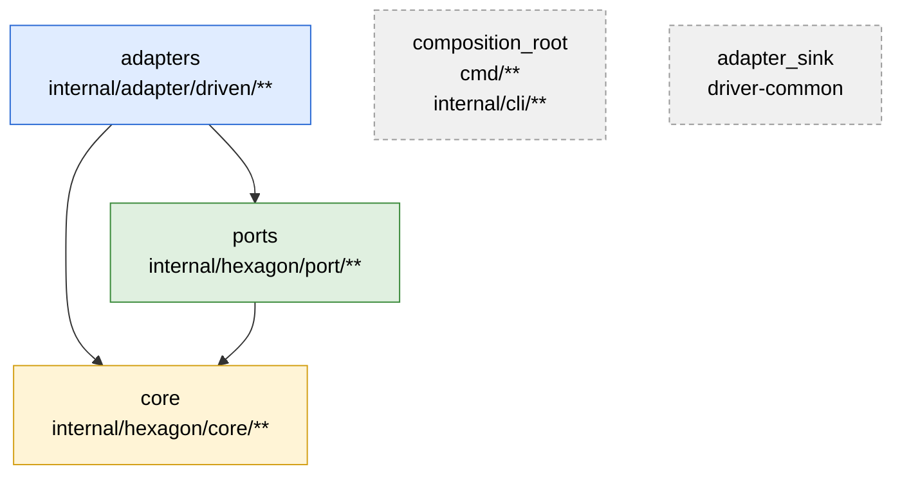

# Benutzerhandbuch: a-check

**Handbuch-Version:** 1.36 · **Software-Version:** [aktuelles Release](../../version.md#aktuell) · **Stand:** 2026-08-30 ·
**Autor:** pt9912 (Maintainer)

---

## 1. Einleitung

### Zweck der Software

**a-check** prüft, ob ein Repository seine **hexagonale Schicht-Architektur**
einhält — sprachübergreifend (C++, Go, Rust, Kotlin, Java, Python, C#, TypeScript), gesteuert über eine
Konfigurationsdatei. a-check liest Ihren Quellcode, meldet Architektur-Verstöße
mit Datei und Zeile und liefert einen Exit-Code, mit dem Sie es als Gate in CI
oder `make` einsetzen. a-check **repariert nichts** und **schreibt nie** in Ihr
Repository.

### Zielgruppe

Repo-Maintainer und CI-Integratoren, die ein einheitliches Architektur-Gate
über mehrere Sprachen wollen. Vorausgesetzt werden Grundkenntnisse in Git,
Docker und `make`; a-check-Interna müssen Sie nicht kennen.

### Voraussetzungen

- **Docker.** a-check läuft ausschließlich als Container — Sie brauchen kein
  lokales Go und keine Sprach-Toolchain.
- Optional **GNU make**, wenn Sie a-check als `make`-Gate einbinden.
- Ein Repository mit erkennbaren Schichten (z. B. `core`, `ports`, `adapters`).

> **Hinweis zum Image.** Das veröffentlichte GHCR-Image ist **digest-gepinnt**
> (`a-check.mk` / `a-check --print-mk`); Konsumenten pinnen den `@sha256:`-Digest
> statt beweglicher Tags. Für lokale Entwicklung gegen einen ungetaggten Stand bauen
> Sie es mit `make build` ([README](../../README.md)) — Tag **`a-check:dev`**. In allen
> Beispielen steht `<a-check-image>` stellvertretend für beides (das digest-gepinnte
> GHCR-Image oder lokal `a-check:dev`).

## 2. Erste Schritte

### Schnelltest

1. Wechseln Sie in Ihr Repository.
2. Erzeugen Sie ein Konfigurations-Gerüst:
   ```bash
   docker run --rm <a-check-image> --print-config > .a-check.yml
   ```
3. Passen Sie `.a-check.yml` an Ihre Schichten an (Abschnitt 4).
4. Führen Sie a-check aus:
   ```bash
   docker run --rm --network none -v "$PWD:/src:ro" <a-check-image> /src
   ```

### Das Ergebnis verstehen

- **Exit-Code 0** — keine Verstöße. Die Standardausgabe (stdout) bleibt leer;
  auf der Fehlerausgabe (stderr) steht die Zusammenfassung `gesamt: 0 Befund(e)`.
- **Exit-Code 1** — mindestens ein Befund. Jeder Befund steht auf stdout als
  `pfad:zeile: regel: meldung`; die Zusammenfassung (Anzahl je Regel und
  Gesamtzahl) steht auf stderr.
- **Exit-Code 2** — Nutzungs- oder Konfigurationsfehler (z. B. fehlende oder
  ungültige `.a-check.yml`, unbekannte Option).

**Zusätzlich möglich: ein Abdeckungs-Hinweis.** Liegen gescannte Dateien in **keiner** Ihrer
`layers`-Schichten, nennt a-check sie nach der Zusammenfassung auf stderr:

```text
Hinweis: 2 gescannte Datei(en) liegen in keiner Schicht und bleiben ungeprüft:
  apps/api/internal/storage/migrate.go
  apps/api/scripts/coverage-overview/main.go
  Abhilfe: Schicht in layers deklarieren oder Datei in exclude aufnehmen.
```

Das ist **kein Befund**: der Exit-Code ändert sich dadurch nicht. Der Hinweis sagt Ihnen, worüber
a-check **nichts aussagt** — für diese Dateien greift keine Schicht-Regel, und Importe **auf** sie
bleiben unbeurteilt. Sie entscheiden, was richtig ist: gehört das Verzeichnis zur Architektur,
deklarieren Sie es in `layers`; gehört es nicht dazu (Werkzeuge, Generate), nehmen Sie es in
`exclude` auf. Ist Ihr Baum vollständig gedeckt, erscheint der Hinweis **nicht**.
Nicht mitgezählt werden `composition_root`-Dateien (die sind bestimmungsgemäß schichtlos) und
`exclude`-Dateien (die werden nie gescannt). Ab zehn Dateien wird die Liste gekürzt und die
Restzahl genannt.

**Und ein Grenz-Hinweis.** a-check extrahiert Importe text-heuristisch; einige gültige
Schreibweisen führt es deshalb zu keiner prüfbaren Kante. Trifft es solche Zeilen, nennt es sie
mit Datei, Zeile und Grund:

```text
Hinweis: 2 Import-Zeile(n) unterliegen einer Heuristik-Grenze und bleiben unbeurteilt:
  app/core/service.py:3: relativer Import — von diesem Backend nicht extrahiert
  src/core/service.h:1: relativer Pfad, den der Auflösungs-Modus "path" nicht auflöst
  Abhilfe: Schreibweise ändern, resolution-Modus anpassen oder die Grenze bewusst hinnehmen.
```

Auch das ist **kein Befund** — der Exit-Code bleibt unberührt. Der Hinweis erscheint **gerade
auch bei null Befunden**, denn dort ist er am wichtigsten: er trennt „sauber" von „nicht
angesehen". Gemeldet werden nur Zeilen, deren **Schreibweise allein** schon verrät, dass sie zu
keiner Kante führen — entweder weil das Backend sie nicht extrahiert (relativer Python-Import,
zweite Direktive auf derselben Zeile) oder weil ein `./`/`../`-Pfad unter Ihrem
`resolution`-Modus kein Ziel treffen kann. Steht der Modus dieser Sprache auf `relative`, ist ein
relativer Pfad der Normalfall und wird **nicht** gemeldet. Ein Baum ohne solche Zeilen erzeugt
**keine** Ausgabe; ab zehn Zeilen wird gekürzt und die Restzahl genannt. Welche Formen dahinter
stehen, führt Abschnitt 6 („a-check findet nichts, obwohl Verstöße erwartet werden") aus.

**Und, im Ernstfall, ein Auflösungs-Hinweis.** Löst in Ihrem **ganzen** Scan kein einziges
Import-Symbol auf eine Schicht auf, obwohl Symbole extrahiert wurden, sagt a-check das deutlich:

```text
Hinweis: Schicht service: 12 Datei(en), 0 von 47 Import-Symbolen lösen auf eine Schicht auf
Hinweis: Schicht ui: 8 Datei(en), 0 von 31 Import-Symbolen lösen auf eine Schicht auf
  Abhilfe: layers-Globs gegen die echten Import-Pfade prüfen oder resolution konfigurieren.
```

**Wenn Sie diesen Hinweis sehen, prüft a-check bei Ihnen praktisch nichts.** Alle Dateien liegen in
Schichten, alle Importe werden gelesen — und trotzdem entsteht keine einzige Kante, weil jedes Ziel
als repo-extern gilt. Ein grünes Gate bedeutet dann nicht „sauber", sondern „nichts angesehen".

Der häufigste Grund: Ihre `layers`-Globs tragen ein Präfix, das in den echten Import-Pfaden nicht
vorkommt. Ein Mono-Repo mit `go/internal/ui/**` als Glob und `example.com/mod/internal/ui` als
Go-Import ist genau dieser Fall — das Segment `go/` steht im Pfad, aber nicht im Modulnamen.
Abhilfe: die Globs an die echten Importpfade angleichen oder die Zuordnung über `resolution`
konfigurieren (Abschnitt 4).

Der Hinweis erscheint **nur** bei diesem Totalausfall. Löst auch nur **eine** Schicht auf, bleibt
er aus — denn eine einzelne Schicht ohne auflösende Importe ist völlig normal: ein
abhängigkeitsfreier Domänenkern importiert nur die Standardbibliothek. Das bedeutet umgekehrt: ist
nur **ein Teil** Ihrer Schichten falsch konfiguriert, sagt a-check nichts. Prüfen Sie Ihre Globs
nach jeder Umstrukturierung, statt sich auf diesen Hinweis zu verlassen.

## 3. Aufgaben

### 3.1 a-check lokal ausführen

**Voraussetzung:** Docker läuft; im Repository liegt eine `.a-check.yml`.

**Vorgehen:**
1. Wechseln Sie in das zu prüfende Repository.
2. Führen Sie aus:
   ```bash
   docker run --rm --network none -v "$PWD:/src:ro" <a-check-image> /src
   ```

**Ergebnis:** a-check listet alle Verstöße und beendet sich mit 0 (sauber)
oder 1 (Befunde).

**Hinweise:** Der Mount `:ro` (read-only) und `--network none` (netzlos) sind
Absicht — a-check braucht keinen Schreibzugriff und keine Netzverbindung.

### 3.2 Eine `.a-check.yml` erstellen

**Voraussetzung:** Sie kennen die Verzeichnisstruktur Ihrer Schichten.

**Vorgehen:**
1. Erzeugen Sie das kommentierte Gerüst:
   ```bash
   docker run --rm <a-check-image> --print-config > .a-check.yml
   ```
2. Tragen Sie unter `languages` Ihre Sprache(n) und Datei-Globs ein.
3. Beschreiben Sie unter `layers` Ihre Schichten mit Pfad-Mustern — optional je Schicht mit einer **Rolle** (`domain`/`app`/`port`/`adapter`, Abschnitt 4).
4. Legen Sie unter `edges` die erlaubten Schicht-Kanten fest.

**Ergebnis:** Eine gültige `.a-check.yml` in der Repo-Wurzel. Details zu jedem
Schlüssel: Abschnitt 4.

**Hinweise:** Ein unbekannter Schlüssel oder Tippfehler führt zu Exit-Code 2 —
a-check prüft nie mit geratenen Standardwerten.

### 3.3 a-check als `make`- oder CI-Gate einbinden

**Voraussetzung:** Ihr Repository nutzt `make` oder eine CI-Pipeline.

**Vorgehen:**
1. Erzeugen Sie das einbindbare Makefile-Fragment:
   ```bash
   docker run --rm <a-check-image> --print-mk > a-check.mk
   ```
2. **Tragen Sie den Release-Digest ein.** Das erzeugte Fragment enthält an dieser Stelle
   einen **Platzhalter**, keinen Digest:
   ```makefile
   A_CHECK_IMAGE ?= ghcr.io/pt9912/a-check@sha256:SETZE-HIER-DEN-RELEASE-DIGEST-EIN
   ```
   Ersetzen Sie ihn durch den Digest des Release, aus dem das Fragment stammt. Zwei Quellen:
   ```bash
   # a) auf dem Host, der das Image gezogen hat:
   docker image inspect --format '{{index .RepoDigests 0}}' <image>:<tag>
   # b) die Release-Notes auf GitHub
   ```
3. Binden Sie es in Ihr `Makefile` ein:
   ```makefile
   include a-check.mk
   ```
4. Rufen Sie das Gate auf:
   ```bash
   make a-check
   ```

**Ergebnis:** `make a-check` prüft das Repository netzlos und read-only und
schlägt bei Befunden fehl (Exit-Code 1).

**Warum Schritt 2 nicht entfallen kann.** a-check kann den Digest des Image, in dem es läuft,
nicht kennen — der entsteht erst beim Push, das Binary ist vorher gebaut. Ein eingebackener Wert
nennte darum immer den **Vorgänger** und sähe dabei autoritativ aus. Der Platzhalter ist bewusst
**kein gültiger Image-Verweis**: eine unveränderte Übernahme bricht sichtbar ab, statt still ein
fremdes Release zu ziehen.

**Eine andere Container-Runtime (podman, nerdctl, ein `docker`-Wrapper).** Das Fragment ruft die
Runtime über `$(DOCKER)` und setzt am Anfang:
```makefile
DOCKER ?= docker
```
**Die Reihenfolge zählt:** `?=` setzt nur, wenn `DOCKER` noch nicht belegt ist. Definieren Sie Ihre
Runtime deshalb **vor** dem `include` — oder hart mit `=`:
```makefile
DOCKER = podman          # vor dem include, oder hart mit =
include a-check.mk
```
Ein `DOCKER ?= podman` **nach** dem `include` greift nicht mehr, weil das Fragment die Variable
dann bereits gesetzt hat.

**Für lokale Entwicklung** gegen einen ungetaggten Stand bauen Sie zuerst `make build` und
überschreiben das Image beim Aufruf:
```bash
make a-check A_CHECK_IMAGE=a-check:dev
```
Heben Sie den `@sha256:`-Digest-Pin bewusst per Commit an, damit CI-Läufe
reproduzierbar bleiben. Vergleiche
das mitgelieferte [`a-check.mk`](../../a-check.mk) dieses Repos — es trägt den echten Digest, weil
es committet ist; das **erzeugte** Fragment trägt den Platzhalter. Den
Release-Prozess (Tagging, Digest-Pin, GHCR) beschreibt [`releasing.md`](releasing.md).

### 3.4 Befunde lesen und beheben

Jeder Befund nennt die Regel. Die Regeln und ihre Behebung:

| Regel | Bedeutung | Behebung |
|---|---|---|
| `core-impurity` | Der Kern (`role: domain`) importiert einen Port, eine `app`- oder Adapter-Schicht oder ein Framework/Tech — die Domäne ist die innerste Schicht. | Domäne rein halten; Port-/Use-Case-Orchestrierung in eine `app`-Schicht, Tech nur im Adapter. |
| `app-impurity` | Die Application-Schicht (`role: app`) importiert einen Adapter oder ein Framework/Tech (Domäne + Ports darf sie nutzen). | Tech/Adapter hinter einen Port legen; die App spricht nur Domäne + Ports. |
| `lateral-adapter` | Ein Adapter importiert einen anderen Adapter. | Gemeinsame Logik in die konfigurierte Senke (`adapter_sink`) ziehen oder über einen Port führen. |
| `lateral-slice` | Eine `app`-Datei importiert eine **fremde Use-Case-Slice derselben `app`-Schicht** (ein anderes Glob *derselben* Schicht). **Kategorisch** (Kante hebt nicht auf). Nur aktiv bei **per-Slice-Globs**; ein einziges Glob lässt die Regel inert. **Getrennte `app`-Layer** (z. B. `services`/`services_geo`) sind edge-regiert, nicht betroffen. | Fachliche Verträge zwischen Slices über **Ports** führen, nicht über direkten Slice-Code (geteilter app-Code ist heute nicht vorgesehen). |
| `tech-leak` | Ein Framework/Tech (Muster als Substring oder Regex, `match`) erscheint außerhalb seines Adapters. | Den Tech-Zugriff in den zugeordneten Adapter kapseln. |
| `port-impurity` | Ein Port importiert einen Adapter oder ein Framework/Tech, oder enthält ein per `forbidden_constructs` (Abschnitt 4) verbotenes Konstrukt. Domänentypen des Kerns darf ein Port referenzieren. | Den Port von Adapter-/Tech-Importen befreien (Kern-Referenzen sind erlaubt). |
| `port-direction-mismatch` | Ein Adapter mit Richtung `driving`/`driven` importiert einen Port der *anderen* Richtung (beide deklariert) — Treiber-Adapter sprechen nur `driving`-Ports, getriebene nur `driven`-Ports. **Kategorisch** (Kante hebt nicht auf). | Den Import über die passende Richtung führen (z. B. über die `app`-Schicht), oder die Schicht-`direction` korrigieren. Ohne `direction` greift die Regel nicht. |
| `port-locality` | Eine `app`-Datei importiert einen **im App-Baum geschachtelten** Port **außerhalb dessen Scope-Verzeichnis** — use-case-lokal (`…/createorder/ports`) ⊂ business-area (`…/order/ports`) ⊂ app-weit (`…/ports`). **Kategorisch.** Nur `app`-Importeure. Bei **klassischem Hexagonal** (Ports als Geschwister der App, `…/ports` neben `…/services`) ist die Regel **inert**. | Den Port auf die passende Ebene heben („so gemeinsam wie nötig") oder den fremden slice-lokalen Port nicht importieren. |
| `construct-leak` | Ein per `constructs` (Abschnitt 4) deklariertes **Roh-Text-Muster** steht außerhalb seiner erlaubten Zone — z. B. ein `dlopen(`-**Aufruf** außerhalb des Plugin-Adapters. Gilt **scan-weit**, auch in Dateien ohne Schicht; Treffer in Kommentaren zählen nicht. | Das Konstrukt in seine Zone verlagern (oder hinter einen Port führen). Ist die Stelle legitim, die Zone im `constructs`-Eintrag erweitern (`adapter` nimmt auch eine Liste). |
| `wrong-direction` | Ein Import läuft entgegen einer erlaubten Schicht-Kante. | Die Kante in `edges` aufnehmen (falls legitim) oder den Import umdrehen. |

> **Vertical-Slice-Regeln (`lateral-slice`/`port-locality`) — Config-Disziplin.** Beide leiten
> Slice- und Port-Scope aus den `layers`-Globs ab und setzen voraus, dass die betroffenen
> `app`-/`port`-Globs als Import-**Ziel** auflösen: sie brauchen ein **sauberes literales Präfix**,
> also per-Slice-/per-Port-Ordner-Verzeichnis-Globs (`…/createorder/**`, `…/ports/**`). Ein Glob mit
> Wildcard **in der Mitte** (`…/**/ports/**`) oder Datei-Endung (`…/*.go`) trägt kein solches Präfix
> und lässt beide Regeln (wie schon die bestehende Ziel-Auflösung) für dieses Ziel wirkungslos — eine
> ausgewiesene Heuristik-Grenze, kein stiller Fehlbefund.
>
> **Was ein solches Glob konkret bedeutet.** Deklarieren Sie Ports über ein tiefen-agnostisches
> `…/application/**/ports/**`, dann gilt: die Port-**Dateien** werden korrekt als `port`
> klassifiziert (`port-impurity` und `forbidden_constructs` greifen dort), **Importe auf diese
> Ports** bleiben aber **unbeurteilt** — a-check kann das Ziel keiner Schicht zuordnen und
> behandelt es als repo-extern. Es entsteht **kein** Befund; die Kante ist schlicht ungegatet.
> Wollen Sie auch die Kanten prüfen, geben Sie den Port-Globs einen sauberen literalen Präfix
> (per Business-Area bzw. per Use-Case aufgezählt: `…/application/orders/**/ports/**` oder
> `…/application/orders/createorder/ports/**`). Frühere Fassungen meldeten hier stattdessen
> `wrong-direction` gegen die *umschließende* Schicht — ein Fehlbefund, der zur falschen
> Reparatur verleitete (eine Kante deklarieren, die dann echte Verstöße verdeckt).

### 3.5 Heuristik-Ausnahmen konfigurieren

a-check erkennt Importe **text-heuristisch**, nicht über einen vollständigen
Parser. Selten wird ein harmloses Symbol fälschlich erkannt (z. B. ein
framework-fremdes `Queue.h`). In diesem Fall tragen Sie es in die Allowlist ein:

```yaml
markers:
  ignore_symbols: ["Queue.h"]
```

`ignore_symbols` wirkt auf erkannte **Importe** (z. B. falsch-positive
`core-impurity`/`tech-leak`); ein per `forbidden_constructs` oder `constructs`
erkanntes Text-Muster wird davon nicht erfasst — dort ist das Muster selbst die
Stellschraube (präzisere Regex bzw. weitere Zone).

### 3.6 Die deklarierte Architektur visualisieren (`--print-graph`)

**Voraussetzung:** Eine gültige `.a-check.yml` (Abschnitt 3.2).

**Vorgehen:**
1. Geben Sie den Architektur-Graphen als Mermaid-Flowchart aus:
   ```bash
   docker run --rm --network none -v "$(pwd)":/src:ro <a-check-image> --print-graph /src > architektur.mmd
   ```
2. Betten Sie die Ausgabe in einen `mermaid`-Codeblock eines Markdown-Dokuments
   ein oder rendern Sie sie mit einem Mermaid-Werkzeug.

**Ergebnis:** Ein Mermaid-`flowchart` der **deklarierten** Architektur: ein Knoten
je Schicht (nach effektiver Rolle eingefärbt), eine Kante je `edges`-Eintrag, eine
gestrichelte Kante je `allow`-Eintrag; `composition_root` und `adapter_sink`
erscheinen als isolierte Notizknoten. Beispiel-Ausgabe (Auszug, a-checks eigene
`.a-check.yml`):



**Hinweise:** Der Modus ist **read-only** und **scannt keine Quellen** — er liest
nur `.a-check.yml` und ist deterministisch (byte-identische Ausgabe bei gleicher
Config). Der Graph zeigt die **deklarierte Absicht**, keinen Beweis über den realen
Code: die kategorischen Regeln (`core-impurity`, `lateral-adapter`, `lateral-slice`,
`port-direction-mismatch`, `port-locality`) und das Roh-Text-Monopol (`construct-leak`)
erscheinen als Legende, nicht als gezeichnete Kante. Ein
`edges`/`allow`-Endpunkt, der auf keine Schicht zeigt, wird als eigener
Dangling-Knoten sichtbar (statt still ignoriert). Ein ladezeitiger Config-Fehler
(inkl. unbekannter Sprache), ein unbekanntes Flag oder ein zusätzliches Argument
nach dem Pfad führt zu Exit-Code 2.

**Als `make`-Target:** Wer `a-check.mk` bereits einbindet (Abschnitt 3.3), erhält
mit `--print-mk` neben `a-check` auch ein **`a-check-graph`**-Target — `make
a-check-graph > architektur.mmd` erzeugt denselben Graphen über dasselbe
digest-gepinnte Image, ohne die `docker run`-Details zu wiederholen.

### 3.7 Eine Vertical-Slice-Architektur (HexSlice) absichern

**Ziel:** Sie haben ein Projekt, dessen Application-Schicht in **Use-Case-Slices** organisiert ist
(je Slice ein Ordner mit Command/Handler/Validator und einem eigenen `ports/`-Ordner), und wollen zwei
Dinge erzwingen: (1) eine Slice greift **nicht** in eine andere hinein, (2) ein slice-lokaler Port wird
**nur** in seiner Slice benutzt. a-check prüft das mit den Regeln `lateral-slice` und `port-locality`.

**Beispielstruktur:**

```text
internal/hexagon/
  domain/order/…                         # Domäne
  application/order/
    createorder/{command,handler,…}.go   # Slice A
    createorder/ports/id_generator.go    #   ihr lokaler Port
    cancelorder/{command,handler,…}.go   # Slice B
    cancelorder/ports/notifier.go        #   ihr lokaler Port
    ports/order_repository.go            # von der Business-Area geteilter Port
internal/adapters/{inbound,outbound}/…   # Adapter
```

**Schritt 1 — jede Slice als eigenes `app`-Glob, jeder Port-Ordner als eigenes `port`-Glob.** Das ist
die entscheidende Regel: a-check leitet Slice- und Port-Grenzen aus den Glob-**Präfixen** ab. Ein Glob
muss deshalb ein **sauberes, literales Verzeichnispräfix** haben — also `…/createorder/**`, **nicht**
`…/createorder/*.go` und **nicht** ein zusammenfassendes `application/**/ports/**`.

```yaml
version: 1
languages: {go: ["**/*.go"]}
layers:
  domain: {globs: ["internal/hexagon/domain/**"], role: domain}
  ports:
    globs:
      - "internal/hexagon/application/order/createorder/ports/**"   # use-case-lokal
      - "internal/hexagon/application/order/cancelorder/ports/**"   # use-case-lokal
      - "internal/hexagon/application/order/ports/**"               # business-area-geteilt
    role: port
  app:
    globs:
      - "internal/hexagon/application/order/createorder/**"          # Slice A
      - "internal/hexagon/application/order/cancelorder/**"          # Slice B
    role: app
  adapters: {globs: ["internal/adapters/**"], role: adapter}
edges:
  - {from: app, to: domain}
  - {from: app, to: ports}
  - {from: ports, to: domain}
  - {from: adapters, to: app}
  - {from: adapters, to: domain}
composition_root: ["cmd/**"]
exclude: ["**/*_test.go"]
```

**Schritt 2 — `make a-check` laufen lassen.** Sauberer Code meldet nichts. Verstöße erscheinen so:

```text
…/createorder/handler.go:9: lateral-slice: app-Slice importiert fremde Slice …/cancelorder
…/createorder/handler.go:10: port-locality: app außerhalb Port-Scope …/cancelorder: …/cancelorder/ports
```

**So beheben Sie sie:**

* **`lateral-slice`** — Slice A braucht etwas aus Slice B: ziehen Sie den gemeinsamen Vertrag in einen
  **geteilten Port** (Business-Area- oder app-weite Ebene) und sprechen Sie ihn über diesen Port an,
  statt die fremde Slice direkt zu importieren.
* **`port-locality`** — Slice A nutzt den **lokalen** Port von Slice B: entweder gehört der Vertrag eine
  Ebene höher (dann in `…/order/ports/**` verschieben — „so gemeinsam wie nötig"), oder der Import ist
  falsch und sollte über einen Port der eigenen Slice laufen.

**Zwei Fallstricke:**

* **Saubere Präfix-Globs sind Pflicht — sonst verlieren Sie mehr als die zwei Regeln.** Ein `*.go`-
  oder `application/**/ports/**`-Glob hat kein literales Verzeichnispräfix; a-check kann das
  Import-**Ziel** dann keiner Schicht zuordnen und behandelt es als **repo-extern**. Die Folge geht
  über `lateral-slice`/`port-locality` hinaus: für solche Ziele greift auch die **Kanten**-Prüfung
  (`wrong-direction`) nicht — ein Import dorthin wird schlicht **nicht beurteilt**, weder positiv
  noch negativ. Nur die **Datei→Schicht**-Zuordnung bleibt intakt: die Port-*Dateien* unter einem
  solchen Glob werden weiterhin als `port` geprüft (`port-impurity`, `forbidden_constructs`). Nutzen
  Sie durchweg `…/**`-Verzeichnisglobs mit literalem Präfix, dann ist die Achse vollständig gegatet
  (Abschnitt 3.4, Kasten).
* **Klassisches Hexagonal ist nicht betroffen.** Liegen Ihre Ports als *Geschwister* der App
  (`hexagon/ports/**` neben `hexagon/services/**`) statt geschachtelt in den Slices, gibt es keine
  Slice-Lokalität — `port-locality` bleibt inert, und getrennte `app`-Schichten mit `edges` lösen kein
  `lateral-slice` aus. Die beiden Regeln sind **opt-in** über die geschachtelte HexSlice-Struktur.

## 4. Konfiguration (`.a-check.yml`)

Die Datei liegt in der Repo-Wurzel und wird **streng** dekodiert. Beispiel:

```yaml
version: 1
languages:
  go: ["**/*.go"]                 # Sprache -> Datei-Globs
layers:
  core:     ["internal/core/**"]  # Schicht -> Pfad-Muster
  ports:    ["internal/ports/**"]
  adapters: ["internal/adapters/**"]
edges:
  - {from: adapters, to: ports}   # erlaubte gerichtete Kante
  - {from: ports,    to: core}    # Ports dürfen Domänentypen referenzieren
  # - {from: adapters, to: core}  # falls Adapter Domänentypen direkt referenzieren
adapter_sink: driver-common       # gemeinsame Adapter-Senke (optional)
tech:
  - {pattern: "net/http", adapter: http}   # Tech -> Adapter (optional)
  # - {pattern: "Q[A-Za-z]", adapter: adapters/ui, match: regex}  # RE2 statt Substring
composition_root: ["cmd/**"]      # verdrahtet alles, von den Schicht-Regeln ausgenommen (optional)
allow:                            # explizit erlaubte Sonderkanten/Re-Exports (optional)
  - {from: ports, to: ports}
forbidden_constructs:             # Schicht -> verbotene Text-Muster (Port-Disziplin, optional)
  ports: ["impl "]                # NUR Schichten mit Rolle `port`; sonst Exit 2 (siehe unten)
constructs:                       # Roh-Text-Monopol: Muster nur in dieser Zone (optional)
  - {pattern: 'dlopen\s*\(', match: regex, adapter: adapters/plugin}
markers:
  ignore_symbols: []              # Heuristik-Ausnahmen (optional)
```

**Pflichtblöcke:** `version`, `languages`, `layers`, `edges`.
**Gültige `languages`-Schlüssel:** genau `go`, `cpp`, `rust`, `kotlin`, `java`, `python`,
`csharp`, `typescript` — exakt so zu schreiben (z. B. `cpp`, **nicht** `c++`; `csharp`,
**nicht** `c#`; `typescript`, **nicht** `ts`);
ein anderer Schlüssel bricht mit Exit-Code 2 ab (kein stilles Ignorieren). Jeder Schlüssel
bildet auf eine Liste von Datei-Globs ab, z. B. `cpp: ["**/*.h", "**/*.cpp"]`,
`rust: ["**/*.rs"]`, `kotlin: ["**/*.kt"]`, `java: ["**/*.java"]`, `python: ["**/*.py"]`,
`csharp: ["**/*.cs"]`, `typescript: ["**/*.ts", "**/*.tsx", "**/*.mts", "**/*.cts"]`.
**Optionalblöcke:** `adapter_sink`, `tech`, `composition_root`, `allow`,
`forbidden_constructs`, `constructs`, `markers`, `resolution`, `exclude`. Fehlt ein Optionalblock, entfällt die
zugehörige Prüfung (kein stiller Standardwert) — fehlt z. B. `adapter_sink`,
darf **kein** Adapter einen anderen importieren (strengere Auslegung). Das
vollständige Schema steht in der [Spezifikation](../../spec/spezifikation.md).

**Verbotene Konstrukte je Schicht (`forbidden_constructs`).** Der Block bindet Text-Muster an eine
**Schicht** und meldet Treffer als `port-impurity`. Ausgewertet wird er **nur für Schichten mit der
Rolle `port`** — das ist die Port-Disziplin
([`AC-FA-RULE-004`](../../spec/lastenheft.md#ac-fa-rule-004--port-disziplin-regel-port-impurity):
*„Ports … tragen keine implementierungs-/dialekt-spezifischen Konstrukte"*), keine Einschränkung,
die sich umgehen ließe.

Ein Eintrag, der **nie melden könnte**, bricht deshalb beim Laden mit **Exit-Code 2** statt still
zu wirken:

| Eintrag | Grund |
|---|---|
| Schicht steht nicht in `layers` | Tippfehler — nichts würde je geprüft |
| Schicht hat nicht die Rolle `port` | wird nicht ausgewertet (Port-Disziplin) |
| leeres Muster (`ports: [""]`) | Never-Match |
| leere Musterliste (`ports: []`) | Never-Match, eine Ebene höher |

Brauchen Sie ein Verbot für eine Schicht **ohne** die Rolle `port`, ist `constructs` das Gegenstück
(siehe unten) — aber **kein Ersatz**: es arbeitet mit Zonen statt Schichten.

**Tech-Muster (`match`, Adapter-Liste, `composition_root`).** Ein `tech`-Eintrag ist
`{pattern, adapter}` mit optionalem `match: substring|regex` (Standard `substring`).
`substring` prüft, ob das importierte Symbol den Text enthält; `match: regex`
interpretiert `pattern` als **RE2-Regex** (unverankert) — nötig, wenn ein Framework
nur als Muster fassbar ist, etwa Qt-Header `Q[A-Za-z]`. `adapter` ist ein Pfad
**oder eine Pfad-Liste** — das Symbol ist dann in **jedem** gelisteten Adapter
erlaubt (z. B. `{pattern: yaml, adapter: [adapters/config, adapters/report]}`;
eine leere Liste, ein leerer Listen-Eintrag oder ein leerer/fehlender
`adapter` bricht mit Exit-Code 2). Der Adapter-Abgleich ist ein
**Teilstring**-Vergleich auf dem Dateipfad (nicht segmentgrenzen-bewusst —
`adapters/config` matcht auch `adapters/configurator`; präzise Fragmente wählen). Standardmäßig ist die Composition Root
von der Tech-Kapselung ausgenommen; mit `composition_root: forbid` am Eintrag
meldet `tech-leak` auch dort (die Schicht-Regel-Ausnahme des Verdrahtungspunkts
bleibt bestehen). Ein unbekannter `match`-Wert, eine ungültige Regex oder ein
`composition_root`-Wert außerhalb `allow`/`forbid` bricht mit
Exit-Code 2 ab. Treffen mehrere Muster dasselbe Symbol, greift das **zuerst notierte**.

**Roh-Text-Monopol (`constructs`).** `tech` beurteilt **Import-Symbole**. Manche
Architektur-Invarianten hängen aber an einem Konstrukt, das gar keine Import-Zeile ist —
klassisch das dynamische Laden: `dlopen`/`dlsym`/`dlclose` dürfen nur im Plugin-Adapter
**aufgerufen** werden, und der Aufruf kommt über einen transitiven Header oder einen lokalen
Prototyp auch ohne eigenen `#include` aus. Dafür gibt es `constructs`: eine Top-Level-Liste
von Einträgen `{pattern, adapter}` mit **derselben** Mechanik wie `tech` —
`match: substring|regex` (Standard `substring`, `regex` = RE2), `adapter` als Pfad **oder**
Pfad-Liste (die erlaubte **Zone**), `composition_root: allow|forbid` (Standard `allow`):

```yaml
constructs:
  - pattern: '\bdl(m?open|sym|close)\s*\('   # RE2: der AUFRUF, nicht der Include
    match: regex
    adapter: src/adapters/plugin             # einzige erlaubte Zone
    composition_root: forbid                 # auch die Verdrahtung darf nicht laden
```

Jedes Vorkommen **außerhalb** aller Zonen ist ein Befund `construct-leak` (Exit-Code 1). Drei
Eigenschaften sind wichtig:

- **Scan-weit.** Die Prüfung gilt für **jede** gescannte Datei — auch für Dateien, die in
  **keinem** `layers`-Glob liegen (ein `main.cpp` außerhalb der Schichten, ein Werkzeug-Ordner).
  Ein Monopol ist eine Aussage über den ganzen Baum. `exclude` greift wie immer davor.
- **Kommentare zählen nicht — außer in Python.** Gematcht wird dieselbe Quelle wie bei den
  Importen. In den C-Syntax-Sprachen (C++, Go, Rust, Kotlin, Java, C#, TypeScript) sind `//` und
  `/* */` entfernt: ein `dlopen(` im Kommentar meldet **nicht** — eine bewusste Abweichung von
  einem `grep`-Skript, das dieselbe Regel trägt (dort ist der Kommentar ein Falsch-Positiv).
  **Python** wird bewusst nicht gestrippt; dort meldet auch ein Treffer im `#`-Kommentar. Grund:
  ein `#` in einer Zeichenkette würde beim Strippen den Zeilenrest verschlucken und könnte einen
  **echten** Treffer verbergen — ein stiller Fehlbefund wiegt schwerer als ein sichtbarer
  Falsch-Positiv. Zeichenketten-Literale bleiben in allen Sprachen die bekannte Heuristik-Grenze.
- **Unabhängig von `forbidden_constructs`.** Der ältere Block bindet Muster an eine **Schicht**
  und meldet als `port-impurity`; `constructs` bindet an eine **Zone**, gilt scan-weit und meldet
  als `construct-leak`. Beide Blöcke existieren nebeneinander.

  **Sie sind komplementär, nicht austauschbar.** `forbidden_constructs` ist eine **Blacklist**
  („dieses Muster ist in Schicht X verboten"), `constructs` ein **Monopol** („dieses Muster ist
  **nur** in Zone Y erlaubt, überall sonst ein Befund"). Wer eine Blacklist braucht, kann sie mit
  `constructs` nur nachbauen, indem er **alle übrigen Zonen** aufzählt — und die Liste bei jeder
  neuen Schicht nachzieht. Für eine Schicht-Blacklist außerhalb der Rolle `port` gibt es derzeit
  kein Werkzeug; das ist eine bekannte Lücke, keine Umgehung, die Sie übersehen haben.

Ein leeres/fehlendes `pattern`, ein leerer/fehlender `adapter` (auch als leere Liste oder leerer
Listen-Eintrag), ein unbekannter `match`-/`composition_root`-Wert oder eine ungültige Regex
brechen mit **Exit-Code 2** ab. Ohne `constructs`-Block entfällt die Regel vollständig.

**Dateien vom Scan ausnehmen (`exclude`).** Die `layers`-/`languages`-Globs kennen
bewusst keine Negation — `exclude` ist das explizite Gegenstück: eine Top-Level-Liste
von Datei-Globs (relativ zur Scan-Wurzel), deren Treffer **vor** der Extraktion
vollständig vom Scan ausgenommen werden (sie liefern weder Import- noch
`forbidden_constructs`-Befunde):

```yaml
exclude:
  - "**/*_test.go"        # Go-Tests (z. B. wenn das abgelöste Gate nur Nicht-Test-Imports prüfte)
  - "**/*.test.ts"        # TS-Tests
  - "**/node_modules/**"  # Fremdcode je Workspace (pnpm/npm)
  - "**/dist/**"          # generierter Output
  - "**/*.d.ts"           # Typ-Generat (Achtung: "**/*.ts" matcht auch .d.ts)
```

`exclude` beschneidet den **Verzeichnis-Walk**, nicht nur die Datei-Liste: ein
Verzeichnis, dessen **ganzer Teilbaum** von einem rekursiven Muster gedeckt ist
(`**/node_modules/**`, `.security/**`, `dist/**`), wird gar nicht erst betreten. Damit
darf ein ausgeschlossener Teilbaum auch **unlesbar oder sehr groß** sein, ohne den Scan
abzubrechen — der Prune greift vor dem Lesen des Ordnerinhalts. Nur solche `…/**`-Muster
prunen; ein Teil-Muster wie `src/*` schließt nur die direkten Dateien aus und lässt
`src/app/…` bewusst im Scan (kein stiller Verlust ganzer Teilbäume). Ein **nicht**
ausgeschlossener unlesbarer Ordner bricht dagegen weiterhin mit Exit-Code 2 ab (kein
stilles Überspringen, das eine Coverage-Lücke verstecken würde).

Ein leerer Glob bricht mit Exit-Code 2 ab; ohne `exclude`-Block wird jede
`languages`-Glob-Datei gescannt (bisheriges Verhalten). Wer zu breit ausschließt,
schwächt sein eigenes Gate — die Config ist die deklarierte Wahrheit.

**Gepunktete Importe auflösen (`resolution`): Python, C#, JVM.** Python-Importe
(`import myapp.adapters.db`, `from myapp.adapters import db` → Modulpfad
`myapp.adapters`) und C#-`using`-Direktiven (`using MyApp.Adapters.Db;`) sind
gepunktete Pfade; damit sie auf Ihre verzeichnisbasierten `layers`-Globs auflösen,
deklarieren Sie den optionalen `resolution`-Block. Rezept: `package_base` = Ihr
Top-Package/-Namespace, `roots` = sein Verzeichnispfad:

```yaml
# src-Layout: src/myapp/{domain,ports,adapters}/…, Importe `myapp.…`
resolution:
  python: {mode: fixed-root, roots: ["src/myapp"], package_base: "myapp"}
  # C# (.NET-Konvention Namespace == Verzeichnis):
  # csharp: {mode: fixed-root, roots: ["src/MyApp"], package_base: "MyApp"}
# flaches Layout (myapp/ direkt an der Repo-Wurzel):
#   python: {mode: fixed-root, roots: ["myapp"], package_base: "myapp"}
```

Dasselbe Schema trägt JVM-Pakete (`package_base: com.example`) und fremdgewurzelte
C++-Includes (`roots: ["src"]`, ohne `package_base`). Hinweis: die
`lateral-adapter`-Prüfung (Sub-Einheit, `adapter_sink`) arbeitet auf dem
**aufgelösten Pfad-Kandidaten** — unter einem `resolution`-Modus schreiben Sie
`adapter_sink` daher als Pfad-Fragment mit Slashes (z. B.
`adapters/driver-common`), nicht als gepunkteten Namen. Voraussetzung ist, dass der
Paket-/Namespace-Baum den Verzeichnis-Baum spiegelt — für C# ist das die verbreitete
.NET-Konvention, aber **nicht** erzwungen: frei deklarierte Namespaces
(Namespace ≠ Ordner) bleiben unaufgelöst (keine schicht-basierte Regel; die
`tech`-Muster greifen unabhängig davon). Der Auflösungs-Modus `namespace`
(Namespace→Datei-Index) ist dafür reserviert und noch nicht implementiert (Exit 2). **Relative** Python-Importe
(`from . import x`, `from ..pkg import y`) werden weiterhin **nicht** extrahiert —
eine dokumentierte Heuristik-Grenze der Python-Extraktion; Architektur-Kanten
prüfen Sie dort über absolute Importe.

**Multi-Modul (KMP/Gradle): mehrere `roots`.** Teilen sich mehrere Module **ein**
`package_base`, aber jedes Modul trägt **disjunkte** Paket-Sub-Namespaces (Kotlin-
Multiplatform/Gradle: `hexagon/domain/…/dev/app/domain/**`,
`hexagon/application/…/dev/app/application/**`), geben Sie **mehrere `roots`** an — je
Modul einen, bis zum geteilten `package_base`:

```yaml
layers:                                     # flache Modul-Globs genügen
  domain:      {globs: ["hexagon/domain/**"], role: domain}
  application: {globs: ["hexagon/application/**"], role: app}
edges:
  - {from: application, to: domain}
resolution:
  kotlin:
    mode: fixed-root
    package_base: dev.app
    roots:
      - hexagon/domain/src/commonMain/kotlin/dev/app
      - hexagon/application/src/commonMain/kotlin/dev/app
```

`a-check` löst den Import dann **datei-mengen-bewusst** auf: der interne FQN wird gegen
die real gescannten Dateien geprüft und trifft — bei disjunkten Sub-Namespaces — genau
**ein** Modul; die Schicht kommt vom realen Ziel, nicht vom Wurzel-Präfix. **Paket-tiefe
Globs sind nicht nötig** (die frühere „paket-spezifische Globs"-Empfehlung entfällt). Löst
dasselbe voll qualifizierte Symbol real unter **≥ 2** Roots in **verschiedene** Schichten
auf (echte Mehrdeutigkeit — dieselbe Klasse in zwei Modulen zweier Schichten), bricht
`a-check` **nach dem Scan** mit Exit-Code 2 ab (ein FQN muss in höchstens eine Schicht
auflösen); dieselbe Klasse in **derselben** Schicht (`expect`/`actual`) löst sauber. Grenze:
liegt das Paket-Verzeichnis unter **keiner** Root real (fehlkonfigurierte/nicht gescannte
Source-Set), bleibt der Import extern — die ehrliche Heuristik-Grenze.

**Split-Package über Modulgrenzen (deklarations-bewusst).** Liegt **dasselbe** Paket real über
zwei Module verschiedener Schichten (z. B. ein Port-Modul und sein getriebenes Adapter-Modul
teilen `dev.app.driver.connection` — JVM-Alltag) und importieren Sie ein **Top-Level-Symbol**,
dessen Datei **≠** Symbolname ist (Kotlin-Extension-Funktion, zweite Klasse je Datei), löst
`a-check` es über die **reale Deklaration** auf: es prüft, welches Modul das Symbol als
Top-Level-Deklaration trägt, und nimmt dessen Schicht — die echte Deklaration sticht einen bloßen
Dateinamen-Treffer. Genau **ein** deklarierendes Modul ⇒ eindeutig; **≥ 2** deklarierende Module
verschiedener Schichten ⇒ Exit-Code 2 (echte Mehrdeutigkeit). Findet sich **keine** Deklaration
und liegt das Paket-Verzeichnis unter ≥ 2 Modulen verschiedener Schichten, bleibt der Import
**extern** (fail-open, kein Geister-Befund) — die ehrliche Heuristik-Grenze; ein **eindeutiges**
Paket-Verzeichnis (genau ein Modul) löst unverändert. Diese Deklarations-Auflösung ist derzeit
**Kotlin**-spezifisch (übrige Sprachen: `Paket == Verzeichnis`) und braucht **keine** zusätzliche
Konfiguration — dieselbe Multi-`roots`-Config genügt.

**Datei-relative Importe auflösen (`mode: relative`): TypeScript.**
TypeScript-Module referenzieren einander relativ zur importierenden Datei
(`./db`, `../core/model`). Deklarieren Sie dafür `mode: relative` — ohne
`roots`/`package_base` (beides bricht dort mit Exit-Code 2):

```yaml
# TypeScript-Hexagon: src/{core,ports,adapters}/…, relative Importe
languages:
  typescript: ["**/*.ts", "**/*.tsx", "**/*.mts", "**/*.cts"]
layers:                         # layers-Globs verzeichnisbasiert halten!
  core:     ["src/core/**"]
  ports:    ["src/ports/**"]
  adapters: ["src/adapters/**"]
edges:
  - {from: adapters, to: ports}
  - {from: ports,    to: core}
resolution:
  typescript: {mode: relative}
```

Aufgelöst werden nur Specifier, die `.`/`..` sind oder mit `./`/`../` beginnen —
lexikalisch gegen das Verzeichnis der importierenden Datei, endungs-agnostisch
(`./db`, `./db.js` und `./db/index` treffen dieselbe Schicht). **Wichtig:**
Halten Sie die `layers`-Globs **verzeichnisbasiert** (`src/core/**`, **nicht**
`src/core/**/*.ts`) — ein Glob mit Datei-Endung macht die Symbol-Auflösung
still blind und kippt die Endungs-Agnostik. Bare-Imports (`react`, `fs`,
`@scope/pkg`) und Specifier, die über die Scan-Wurzel hinausführen, bleiben
bewusst unaufgelöst (kein Befund; `tech`-Muster greifen am Roh-Symbol —
Bare-Imports sind für `tech`-Zuordnungen ideal sichtbar). tsconfig-Aliasse
(`paths`/`baseUrl`) werden nicht aufgelöst. Hinweis: `.cts`-Dateien
importieren typischerweise per `require()`-**Ausdruck** und fallen damit unter
die dokumentierte Ausdrucks-Grenze (dynamisches `import()`/`require()` wird
nicht extrahiert).

Zwei weitere dokumentierte Grenzen der Heuristik: (1) Die **Subpaket-Form**
`from myapp import adapters` liefert nur den Modulpfad `myapp` und löst damit auf
keine Schicht auf — schreiben Sie kanten-relevante Importe als
`from myapp.adapters import db` bzw. `import myapp.adapters.db`. (2) Ein **fremdes
Top-Level-Modul, das zufällig wie ein Schicht-Verzeichnis heißt** (z. B. ein
Third-Party-Paket `adapters`), kann unter dem Rezept fälschlich auf diese Schicht
auflösen. `markers.ignore_symbols` ist ein **Substring**-Filter — `"adapters"`
würde auch jeden legitimen `myapp.adapters`-Import verschlucken (falsch-grün);
eine Ausnahme braucht ein Fragment, das **nur** im Fremdsymbol vorkommt (z. B.
ein Submodul wie `"adapters.vendorx"`). Gibt es keins, bleibt die Kollision eine
dokumentierte Grenze der Paket==Verzeichnis-Voraussetzung.

**Schicht-Rollen (`role`).** Ein `layers`-Eintrag ist **entweder** eine Glob-Liste
(`name: [globs]`) **oder** ein Objekt `{globs: [...], role: <rolle>, direction: <richtung>}`
(`direction` optional, siehe unten). Die Rolle steuert, welche Reinheits-Regel auf die
Schicht greift — **unabhängig vom Namen**:

- `domain` — innerste Schicht; importiert nur sich selbst (keinen Port, keine `app`-/Adapter-Schicht, kein Tech) → sonst `core-impurity`.
- `app` — Application-/Use-Case-Schicht; darf `domain` **und** `port` nutzen, aber keinen Adapter/Tech → sonst `app-impurity`.
- `port` — Abstraktionen; dürfen `domain` referenzieren, aber keinen Adapter/Tech → sonst `port-impurity`.
- `adapter` — Technik-Anbindung; importiert keinen fremden Adapter (außer der `adapter_sink`) → sonst `lateral-adapter`.

Fehlt `role`, wird sie aus konventionellen Namen abgeleitet (`core`→`domain`,
`ports`→`port`, `adapters`→`adapter`, `application`/`app`→`app`); eine explizite `role:`
hat **Vorrang**. Eine Schicht ohne Rolle (weder deklariert noch ableitbar) wird nur
kanten-geprüft. So lässt sich ein feineres Vier-Schichten-Hexagon
(`domain ← app ← port ← adapter`) mit **beliebigen** Schicht-Namen modellieren:

```yaml
layers:
  domain:   ["src/domain/**"]                                  # Rolle per Inferenz (domain)
  usecase:  {globs: ["src/app/**"], role: app}                 # fremder Name -> explizite Rolle
  ports:    ["src/ports/**"]
  geometry: {globs: ["src/adapters/geometry/**"], role: adapter}
edges:
  - {from: usecase, to: domain}   # app darf die Domäne orchestrieren
  - {from: usecase, to: ports}    # ... und über Ports nach außen sprechen
  - {from: ports,   to: domain}   # Ports sprechen die Sprache der Domäne
```

**Richtung (`direction`).** Eine `port`- oder `adapter`-Schicht trägt **optional** eine
Richtung `direction: driving` oder `direction: driven` — **orthogonal** zur Rolle.
`driving` = primär/inbound (Use-Case-Schnittstelle, vom Treiber-Adapter aufgerufen),
`driven` = sekundär/outbound (vom Kern/App definiert, vom getriebenen Adapter
implementiert). Ein `role: adapter` spricht dann nur Ports **seiner** Richtung; importiert
ein driving-Adapter einen driven-Port (oder umgekehrt, beide Seiten deklariert), ist das
`port-direction-mismatch` (kategorisch — `edges`/`allow` heben nicht auf). Tragen die
Schichten **keine** `direction`, ändert sich nichts — die Dimension ist rein additiv und
braucht getrennte `driving`/`driven`-**Adapter- und -Port**-Schichten, um zu greifen.

## 5. Berechtigungen und Sicherheit

a-check kennt keine Benutzerrollen — es ist ein Kommandozeilen-Werkzeug. Statt
Rechten gelten Garantien:

- **Read-only:** a-check schreibt nie in das geprüfte Repository (Mount mit `:ro`).
- **Netzlos:** mit `--network none` öffnet a-check keine Netzverbindungen.
- **Hermetisch:** Das Image ist distroless/static und digest-gepinnt — gleicher
  Lauf, gleiches Ergebnis.

Geben Sie keine Zugangsdaten oder Tokens an a-check — es benötigt keine.

## 6. Fehlerbehebung

### Fehler: Docker findet das Image nicht (`Unable to find image` / `pull access denied`)

**Ursache:** Entweder ist das lokale Dev-Image `a-check:dev` noch nicht gebaut, oder
es wird ein nicht existierender Tag referenziert — das veröffentlichte GHCR-Image wird
per `@sha256:`-Digest konsumiert (nicht über einen `:0.1.0`-artigen Tag).

**Lösung:** Für lokale Entwicklung das Image mit `make build` bauen und `a-check:dev`
verwenden — in `docker run`-Aufrufen als `<a-check-image>`, im Gate über
`make a-check A_CHECK_IMAGE=a-check:dev`. Für das veröffentlichte Image den
digest-gepinnten Verweis aus `a-check.mk` bzw. `a-check --print-mk` nutzen.

### Fehler: a-check bricht mit Exit-Code 2 ab

**Ursache:** Die `.a-check.yml` fehlt, ist ungültig oder enthält einen
unbekannten Schlüssel; oder es wurde eine unbekannte Option übergeben.

**Lösung:**
1. Prüfen Sie, ob `.a-check.yml` in der Scan-Wurzel liegt.
2. Lesen Sie die Fehlermeldung auf der Fehlerausgabe (sie nennt die Zeile).
3. Vergleichen Sie mit dem Gerüst aus `--print-config`.

### Fehler: a-check findet nichts, obwohl Verstöße erwartet werden

**Ursache:** Die `layers`- oder `languages`-Globs passen nicht auf Ihre Pfade —
oder ein zu breiter `exclude`-Glob nimmt die betroffenen Dateien vom Scan aus.

**Lösung:**
1. Prüfen Sie, ob die Globs (z. B. `internal/core/**`) Ihre echten Verzeichnisse treffen.
2. Prüfen Sie, ob die Datei-Endung unter `languages` erfasst ist.
3. Prüfen Sie Ihre `exclude`-Globs: ein zu breites Muster (z. B. `src/**` statt
   `**/*_test.go`) schließt still auch produktiven Code aus — wer zu breit
   ausschließt, schwächt sein eigenes Gate (Abschnitt 4).
4. Prüfen Sie die **Schreibweise der Import-Zeile**. a-check extrahiert
   text-heuristisch und zeilenverankert; einige gültige Formen greift es
   deshalb nicht:

   | Form | Beispiel | Verhalten |
   |---|---|---|
   | **Mehrere Direktiven auf einer Zeile** | `import a, b` · `using A; using B;` | nur die **erste** wird gegriffen (`a` bzw. `A`) |
   | **Relative Python-Importe** | `from . import x` · `from ..pkg import y` | nicht extrahiert |
   | Kompaktes TypeScript ohne Whitespace | `import{A}from'./b'` | nicht gegriffen |
   | Import-ähnliche Zeilen in Strings/Docstrings | `s = "import x"` | nicht gegriffen |

   Die Mehrfach-Form betrifft **alle Backends außer C++** — dort ist eine
   Präprozessor-Direktive ohnehin auf ihre Zeile beschränkt. In Python ist
   `import a, b` idiomatisch und damit der praktisch häufigste Fall: schreiben
   Sie die Importe einzeilig, wenn eine Architektur-Kante daran hängt.

   Das ist eine **ausgewiesene Heuristik-Grenze** ([`AC-QA-02`](../../spec/lastenheft.md#ac-qa-02--hermetik-und-ehrliche-heuristik-grenze)),
   kein Fehler. Die vollständige Liste aller Grenzen führt der Out-of-Scope-Absatz
   von [`AC-FA-EXTRACT-001`](../../spec/lastenheft.md#ac-fa-extract-001--sprach-backends-für-die-import-extraktion)
   im Lastenheft; hier stehen die, die beim Konfigurieren auffallen.

   **Die ersten beiden Formen müssen Sie nicht suchen:** a-check meldet sie beim Scan selbst, mit
   Datei und Zeile (Grenz-Hinweis, Abschnitt 2). Prüfen Sie zuerst dort — steht Ihre Datei in dem
   Hinweis, ist die Schreibweise die Ursache. Die übrigen Formen der Tabelle bleiben still; für sie
   ist diese Liste die Quelle.

### Fehler: ein `tech-leak`/`core-impurity`-Befund ist falsch-positiv

**Ursache:** Ein gleichnamiges, aber framework-fremdes Symbol (Heuristik-Grenze).

**Lösung:** Tragen Sie das Symbol in `markers.ignore_symbols` ein (Abschnitt 3.5).

## 7. FAQ

**Brauche ich Go installiert?** Nein. a-check läuft als Container; Docker genügt.

**Verändert a-check meinen Code?** Nein. a-check ist read-only und meldet nur.

**Warum hat a-check eine Heuristik-Grenze?** Es liest Importe text-basiert (kein
vollständiger Parser je Sprache) — das hält den Lauf hermetisch und schnell. Die
Grenze ist dokumentiert; Ausnahmen sind konfigurierbar.

**Kann ich mehrere Sprachen in einem Repo prüfen?** Ja — tragen Sie mehrere
Einträge unter `languages` ein.

**Wie nehme ich Test-Dateien, `node_modules/` oder generierten Code vom Scan
aus?** Über den `exclude`-Block (Datei-Globs, wirken vor der Extraktion) —
siehe „Dateien vom Scan ausnehmen" in Abschnitt 4.

## 8. Glossar

- **Kern (core):** die reine Domänenlogik ohne I/O, Framework oder Ports (innerste Schicht — kennt nur sich selbst).
- **Port:** eine Schnittstelle/Abstraktion, über die der Kern mit der Außenwelt spricht.
- **Adapter:** die konkrete Anbindung an Technik (Datenbank, HTTP, UI …).
- **Composition Root:** der Ort, der konkrete Adapter an den Kern verdrahtet (z. B. `main`); von den Schicht-Regeln ausgenommen (die `tech-leak`-Ausnahme ist je `tech`-Eintrag per `composition_root: forbid` abschaltbar).
- **`exclude`:** Datei-Globs, deren Treffer vor der Extraktion vollständig vom Scan ausgenommen werden (Tests, `node_modules/`, generierter Code).
- **Schicht:** eine über Pfad-Muster (`layers`) definierte Datei-Gruppe (z. B. `core`, `ports`, `adapters`).
- **Rolle (`role`):** die Funktion einer Schicht (`domain`/`app`/`port`/`adapter`), die bestimmt, welche Reinheits-Regel greift — explizit per `role:` oder aus dem Schicht-Namen abgeleitet (Abschnitt 4).
- **Kante (`edges`):** eine erlaubte gerichtete Abhängigkeit zwischen zwei Schichten (`from` → `to`).
- **`adapter_sink`:** eine gemeinsame Senke, die alle Adapter importieren dürfen (Ausnahme von `lateral-adapter`).
- **Sub-Einheit:** ein Unterverzeichnis innerhalb einer Adapter-Schicht — `lateral-adapter` trennt Sub-Einheiten, nie Dateinamen; Dateien direkt im Schicht-Root bilden eine gemeinsame Root-Einheit (eigene `.cpp`/`.h`-Paare melden nicht). Endungslose Importe (z. B. TypeScript `./b` oder Go-Paket-Pfade) gelten als eigene Einheit.
- **`forbidden_constructs`:** je Schicht konfigurierte verbotene Text-Muster (für `port-impurity`). Nur für Schichten mit der Rolle `port`; ein Eintrag, der nie melden könnte (unbekannte Schicht, andere Rolle, leeres Muster, leere Liste), bricht mit Exit-Code 2 statt still zu wirken.
- **Befund:** eine gemeldete Regelverletzung (Datei, Zeile, Regel, Meldung).
- **`core-impurity` / `app-impurity` / `lateral-adapter` / `lateral-slice` / `tech-leak` / `port-impurity` / `port-direction-mismatch` / `port-locality` / `construct-leak` / `wrong-direction`:** die zehn geprüften Regeln (Abschnitt 3.4).
- **Zone (`constructs`):** das Pfad-Fragment (oder die Liste), in dem ein Roh-Text-Muster allein vorkommen darf; alles außerhalb ist `construct-leak`. Anders als eine **Schicht** ist eine Zone nicht an `layers` gebunden — sie gilt scan-weit.
- **Use-Case-Slice:** eine über ein eigenes `app`-Glob abgegrenzte Vertical Slice; `lateral-slice` isoliert sie gegeneinander (Verträge laufen über Ports). **Port-Scope:** das Verzeichnis, das den Port-Ordner besitzt (use-case-lokal ⊂ business-area ⊂ app-weit); `port-locality` erzwingt ihn.
- **Heuristik-Grenze:** a-check erkennt Importe per Textmuster, nicht per Parser; seltene Fehltreffer sind konfigurierbar ausnehmbar.
- **Digest-Pin:** ein `@sha256:`-Verweis auf eine exakte Image-Version für reproduzierbare Läufe.

## 9. Support und Kontakt

Quellcode, Issues und Releases: das Projekt-Repository `pt9912/a-check`.
Verbindlich für das Verhalten sind das [Lastenheft](../../spec/lastenheft.md)
und die [Spezifikation](../../spec/spezifikation.md); ein Überblick steht in der
[README](../../README.md).

## 10. Änderungshistorie

| Handbuch-Version | Stand | Änderung |
|---|---|---|
| 1.0 | 2026-06-21 | Erstfassung zur Software-Version 0.1.0. |
| 1.1 | 2026-06-21 | Review-Einarbeitung: Vorab-Image-Pfad fürs make-Gate (`A_CHECK_IMAGE=a-check:dev`), Config-Schlüssel `allow`/`forbidden_constructs`, Exit-0-stderr-Klarstellung, Image-Fehlerfall, Glossar, Autor. |
| 1.2 | 2026-06-21 | Quer-Verweis aus §3.3 auf den neuen Release-Leitfaden [`releasing.md`](releasing.md). |
| 1.3 | 2026-06-21 | §4: die vier gültigen `languages`-Schlüssel (`go`/`cpp`/`rust`/`kotlin`) explizit gelistet; Software-Version 0.1.0 veröffentlicht. |
| 1.4 | 2026-06-22 | §3.4/§4 an Lastenheft 0.2.0 angeglichen: `port-impurity` — Ports dürfen Domänentypen des Kerns referenzieren (verboten bleiben Adapter/Tech); `ports`-Schicht + `ports → core`-Kante im Beispiel. |
| 1.5 | 2026-06-22 | §3.4/Glossar an Lastenheft 0.5.0 angeglichen: neue Regel `app-impurity` (Rolle `app`); `core-impurity` verschärft — die Domäne kennt keine Ports (`domain↛port` kategorisch); sechs Regeln. |
| 1.6 | 2026-06-22 | §3.2/§4/Glossar: die Schicht-`role` dokumentiert (`domain`/`app`/`port`/`adapter`, Objektform `{globs, role}`, Namens-Inferenz, Vorrang, Vier-Schichten-`app`-Modell) — Nachtrag zur Rollen-/`app`-Einführung (Lastenheft 0.3.0–0.5.0). |
| 1.7 | 2026-06-22 | Software-Version **0.2.0** (GHCR-Release `v0.2.0` veröffentlicht, digest-gepinnt `@sha256:4132a7af…`). |
| 1.8 | 2026-06-23 | §3.4/§4/Glossar an Lastenheft 0.6.0 angeglichen: neue Regel `port-direction-mismatch` + Config-Schlüssel `direction` (optionale Schicht-Richtung `driving`/`driven`, orthogonal zur Rolle; ein Adapter spricht nur Ports seiner Richtung, kategorisch); sieben Regeln. |
| 1.9 | 2026-06-23 | Software-Version **0.3.0** (GHCR-Release `v0.3.0` veröffentlicht, digest-gepinnt `@sha256:93be49a6…`). |
| 1.10 | 2026-06-23 | §1/§4 an Lastenheft 0.7.0: fünftes Sprach-Backend **Java** (`languages`-Schlüssel `java`, `import`/`import static`); Sprach-Aufzählung + `languages`-Enum/Beispiel ergänzt. |
| 1.11 | 2026-07-01 | §3.4/§4 an Lastenheft 0.8.0: `tech`-Muster optional als **RE2-Regex** (`match: substring\|regex`, Standard `substring`) — nötig für nur als Muster fassbare Frameworks (Qt `Q[A-Za-z]`); Mehrfach-Treffer nach Deklarationsreihenfolge (erstes Muster gewinnt); Exit 2 bei ungültigem `match`/leerer bzw. ungültiger Regex. |
| 1.12 | 2026-07-01 | Software-Version **0.4.0** (GHCR-Release `v0.4.0` veröffentlicht, digest-gepinnt `@sha256:b0d6e33c…`) — `match: regex` + Java-Backend jetzt im veröffentlichten Image; die v0.3.0-Verfügbarkeitsnotiz zu `match` entfällt. |
| 1.13 | 2026-07-02 | §1/§4 an Lastenheft 0.11.0: sechstes Sprach-Backend **Python** (`languages`-Schlüssel `python`; `import` + `from … import` → Modulpfad, relative Importe dokumentierte Grenze) inkl. `resolution`-Rezept (`fixed-root` + `package_base`, Lastenheft 0.10.0 — der Block war hier noch undokumentiert); §4-Currency: ein unbekannter `languages`-Schlüssel bricht seit Lastenheft 0.9.0 mit Exit 2 (statt „wird ignoriert"). |
| 1.14 | 2026-07-02 | Software-Version **0.5.0** (GHCR-Release `v0.5.0` veröffentlicht, digest-gepinnt `@sha256:81951e61…`) — Python-Backend, `resolution`-Block und die Exit-2-Härtung für unbekannte Sprachen jetzt im veröffentlichten Image. |
| 1.15 | 2026-07-02 | §1/§4 an Lastenheft 0.12.0: siebtes Sprach-Backend **C#** (`languages`-Schlüssel `csharp`; `using`-Direktiven inkl. `global`/`static`/Alias-Ziel, `using`-Statements nie gewertet); `resolution`-Absatz um das C#-Rezept + Namespace==Verzeichnis-Grenze (reservierter `namespace`-Modus) erweitert. Noch nicht im veröffentlichten Image (folgt mit dem nächsten Release). |
| 1.16 | 2026-07-02 | Software-Version **0.6.0** (GHCR-Release `v0.6.0` veröffentlicht, digest-gepinnt `@sha256:b349a150…`) — C#-Backend jetzt im veröffentlichten Image; die 1.15-Verfügbarkeitsnotiz entfällt. |
| 1.17 | 2026-07-03 | §1/§4 an Lastenheft 0.13.0: achtes Sprach-Backend **TypeScript** (`languages`-Schlüssel `typescript`; ES-Module-Importe/Re-Exports inkl. `import type` und mehrzeilig umbrochener Imports, Specifier in `'…'`/`"…"`) + neuer Auflösungs-Modus **`mode: relative`** (datei-relativ; Rezept + Warnung „`layers`-Globs verzeichnisbasiert halten"; Bare-Imports/tsconfig-Aliasse bleiben unaufgelöst). Noch nicht im veröffentlichten Image (folgt mit dem nächsten Release). |
| 1.18 | 2026-07-03 | Software-Version **0.7.0** (GHCR-Release `v0.7.0` veröffentlicht, digest-gepinnt `@sha256:41eb368e…`) — TypeScript-Backend + `relative`-Modus jetzt im veröffentlichten Image; die 1.17-Verfügbarkeitsnotiz entfällt. |
| 1.19 | 2026-07-03 | §4 an Lastenheft 0.14.0 (CR d-check-Pilot): `tech.adapter` auch als Pfad-**Liste** (Symbol in jedem gelisteten Adapter erlaubt) + `composition_root: allow\|forbid` je `tech`-Eintrag + neuer Abschnitt „Dateien vom Scan ausnehmen (`exclude`)" (Top-Level-Datei-Globs vor der Extraktion; `.d.ts`-Hinweis). Noch nicht im veröffentlichten Image (folgt mit dem nächsten Release). |
| 1.20 | 2026-07-03 | Software-Version **0.8.0** (GHCR-Release `v0.8.0` veröffentlicht, digest-gepinnt `@sha256:a1c9c4d6…`) — d-check-Pilot-Deltas (`tech.adapter`-Liste, `composition_root: allow\|forbid`, `exclude`) jetzt im veröffentlichten Image; die 1.19-Verfügbarkeitsnotiz entfällt. |
| 1.21 | 2026-07-03 | 0.14.0-Nachzug außerhalb §4: Fehlerbehebung „findet nichts" um die `exclude`-Falle (zu breite Globs) ergänzt; FAQ-Eintrag „Tests/`node_modules`/Generat ausnehmen"; Glossar um `exclude` + `composition_root: forbid`-Hinweis. |
| 1.22 | 2026-07-03 | An Lastenheft 0.15.0: Glossar-Eintrag **Sub-Einheit** — `lateral-adapter` trennt Unterverzeichnisse, nie Dateinamen; Dateien direkt im Schicht-Root bilden eine gemeinsame Root-Einheit (eigene `.cpp`/`.h`-Paare in flachen Adaptern melden nicht mehr). Noch nicht im veröffentlichten Image (folgt mit dem nächsten Release). |
| 1.23 | 2026-07-04 | Software-Version **0.9.0** (GHCR-Release `v0.9.0` veröffentlicht, digest-gepinnt `@sha256:0378211f…`) — adapterSeg-Root-Sub-Einheit mit Blatt-Klassifikation (`lateral-adapter`) jetzt im veröffentlichten Image; die 1.22-Verfügbarkeitsnotiz entfällt. |
| 1.24 | 2026-07-04 | Software-Version **0.10.0** (GHCR-Release `v0.10.0` veröffentlicht, digest-gepinnt `@sha256:0932cb1d…`) — fail-closed-Guard gegen mehrdeutige Mehr-Wurzel-Auflösung (`mode: fixed-root`, ≥ 2 `roots`, die zwei Schichten erzwingen → Exit 2) jetzt im veröffentlichten Image; KMP-Rezept: paket-spezifische Globs tiefer als die Roots. |
| 1.25 | 2026-07-05 | Software-Version-Kopf verweist jetzt auf das [Release-Register](../../version.md#aktuell) statt einer literalen Nummer (slice-018, Opt 1) — die eine driftende Live-Stelle im Handbuch entfällt; die historischen „Software-Version X.Y.Z"-Zeilen bleiben als Release-Ledger. |
| 1.26 | 2026-07-05 | §4 an Lastenheft 0.17.0: `resolution`-Absatz um das **Multi-Modul (KMP/Gradle)**-Rezept erweitert — mehrere `roots` mit geteiltem `package_base` lösen den FQN **datei-mengen-bewusst** gegen die realen Dateien auf (disjunkte Sub-Namespaces → genau ein Modul; **flache** Modul-Globs genügen, keine paket-tiefen mehr nötig); gleicher FQN real in ≥ 2 Roots **verschiedener** Schichten → Exit 2 nach dem Scan, `expect`/`actual` same-layer sauber. Löst den Ladezeit-Guard aus 1.24/Software-Version 0.10.0 ab (slice-027). |
| 1.27 | 2026-07-06 | §4 an Lastenheft 0.18.0: `resolution`-Absatz um das **Split-Package über Modulgrenzen (deklarations-bewusst)**-Rezept erweitert — teilt sich **ein** Paket über zwei Schicht-Module und wird ein Top-Level-Symbol importiert, dessen Datei ≠ Symbolname ist (Kotlin-Extension-Funktion, zweite Klasse), löst `a-check` über die **reale Deklaration** auf (genau ein deklarierendes Modul → eindeutig; ≥ 2 verschiedene Schichten → Exit 2; kein Treffer, Paketverzeichnis in ≥ 2 Schichten → extern/fail-open; eindeutiges Paketverzeichnis → löst unverändert). Kotlin-spezifisch, keine Zusatz-Config (slice-031). |
| 1.28 | 2026-07-09 | Neuer Abschnitt 3.6 „Die deklarierte Architektur visualisieren (`--print-graph`)": `a-check --print-graph [pfad]` rendert die deklarierte Architektur aus `.a-check.yml` als **Mermaid-Flowchart** (read-only, kein Scan, deterministisch) — ein Knoten je Schicht nach effektiver Rolle, Kante je `edges`, gestrichelte Kante je `allow`, `composition_root`/`adapter_sink` als Notizknoten, implizite Regeln als Legende; mit Beispiel-Ausgabe. Ladezeitiger Config-Fehler (inkl. unbekannter Sprache)/unbekanntes Flag/Restargument → Exit 2. Noch nicht im veröffentlichten Image (folgt mit dem nächsten Release). (Lastenheft 0.19.0, slice-032) |
| 1.29 | 2026-07-09 | §3.6 um die `make`-Variante ergänzt: das `--print-mk`-Fragment `a-check.mk` liefert neben `a-check` jetzt ein **`a-check-graph`**-Target (`make a-check-graph > architektur.mmd`), das `--print-graph` über dasselbe digest-gepinnte Image fährt (Lastenheft/Spez 0.20.0, slice-033). Noch nicht im veröffentlichten Image (folgt mit dem nächsten Release). |
| 1.31 | 2026-07-24 | Lastenheft 0.21.0: zwei neue Regeln der **Vertical-Slice-Achse** — `lateral-slice` (`app`-Datei importiert eine fremde Use-Case-Slice **derselben `app`-Schicht**; getrennte `app`-Layer sind edge-regiert) und `port-locality` (`app`-Datei importiert einen **im App-Baum geschachtelten** Port außerhalb dessen Scope: use-case-lokal ⊂ business-area ⊂ app-weit; Geschwister-Ports/klassisch inert); beide kategorisch, nur `app`-Importeure, opt-in über die geschachtelte Struktur. Neue **Aufgabe §3.7** „Vertical-Slice-Architektur (HexSlice) absichern" (Arbeitsanleitung mit Beispiel-Config + Behebung), §3.4-Regeltabelle (neun Regeln) + Config-Disziplin-Kasten (saubere Präfix-Globs; `**/…/**`/`*.go` lösen nicht auf), Glossar. Noch nicht im veröffentlichten Image (slice-039, [ADR-0026](../plan/adr/0026-hexslice-vertical-slice-regeln.md)). |
| 1.32 | 2026-07-24 | §3.6: die `--print-graph`-Legende nennt jetzt **alle fünf** kategorischen Regeln (`lateral-slice`/`port-locality` ergänzt). Spez 0.23.0, slice-040. Noch nicht im veröffentlichten Image. |
| 1.33 | 2026-07-25 | Lastenheft 0.22.0: neuer Optionalblock **`constructs`** und Regel **`construct-leak`** — ein Roh-Text-Muster darf nur in seiner **Zone** vorkommen (dieselbe Mechanik wie `tech`: `adapter` als Pfad/Liste, `match: substring\|regex`, `composition_root: allow\|forbid`), jedes Vorkommen außerhalb ist ein Befund. Damit sind Konstrukte gatebar, die **keine Import-Zeile** sind (typisch: das `dlopen`-Aufruf-Monopol im Plugin-Adapter). §4 um den Abschnitt „Roh-Text-Monopol (`constructs`)" + Beispiel-Config erweitert, §3.4-Regeltabelle um `construct-leak`, §3.5 (Allowlist wirkt nicht auf Text-Muster), §3.6-Legende. Scan-weit (auch Dateien ohne Schicht), Kommentar-Treffer zählen nicht (ausgewiesene Abweichung von einer `grep`-Regel). **Ausgeliefert mit [v0.16.0](../../version.md#aktuell)** (slice-042, [ADR-0027](../plan/adr/0027-constructs-roh-text-monopol.md)). |
| 1.34 | 2026-07-25 | §3.4-Kasten „Config-Disziplin" **und** §3.7-Fallstrick „Saubere Präfix-Globs" präzisiert. Ein Glob mit Wildcard **in der Mitte** (`…/application/**/ports/**`) hat kein literales Verzeichnispräfix; sein Import-**Ziel** gilt darum als repo-extern und wird **gar nicht beurteilt** — betroffen sind nicht nur `lateral-slice`/`port-locality`, sondern auch die **Kanten**-Prüfung (`wrong-direction`). Intakt bleibt die Datei→Schicht-Zuordnung: die Port-*Dateien* werden weiter als `port` geprüft (`port-impurity`, `forbidden_constructs`). Bisher meldete a-check hier stattdessen einen `wrong-direction`-**Fehlbefund** gegen die umschließende Schicht, dessen naheliegende Reparatur echte Verstöße verdeckt hätte. Wer die Kanten mitgaten will, gibt den Port-Globs einen sauberen literalen Präfix. Spez 0.25.0, [ADR-0028](../plan/adr/0028-ziel-glob-schattenwurf.md), slice-044. **Ausgeliefert mit [v0.16.0](../../version.md#aktuell).** |
| 1.35 | 2026-07-25 | §2 „Das Ergebnis verstehen" um den **Abdeckungs-Hinweis** ergänzt: liegen gescannte Dateien in keiner `layers`-Schicht, nennt a-check sie nach der Zusammenfassung auf stderr — **kein Befund, kein Exit-Code-Wechsel**, sondern die Aussage, worüber a-check nichts aussagt (Abhilfe: `layers` oder `exclude`). `composition_root`- und `exclude`-Dateien zählen nicht; ab zehn Dateien gekürzt mit genannter Restzahl; vollständig gedeckte Bäume erzeugen keinen Hinweis. Ebenfalls sichtbar: eine schichtlose Quelldatei heißt im `wrong-direction`-Befund jetzt `(ohne Schicht)` statt gar nichts. Spez 0.26.0, [ADR-0029](../plan/adr/0029-abdeckungs-diagnose-advisory.md), slice-043. **Ausgeliefert mit [v0.16.0](../../version.md#aktuell).** |
| 1.36 | 2026-08-30 | `a-check --help` trägt jetzt eine vollständige Usage-Ausgabe (Kurzbeschreibung, Aufruf-Syntax, Konfigurations-Hinweis) und **verweist auf dieses Handbuch**; dieselbe URL steht im Kopfkommentar des per `--print-mk` erzeugten Fragments, das in ein fremdes Repo reist ([AC-FA-CLI-003](../../spec/lastenheft.md#ac-fa-cli-003--usage-ausgabe-und-handbuch-verweis)). Die URL ist **tag-frei** — sie kann nicht veralten, zeigt aber auch nie auf den Stand eines gepinnten Image; wer die passende Fassung braucht, liest den Software-Versions-Stempel im Kopf dieses Dokuments. |
| 1.36 | 2026-08-09 | §6 „a-check findet nichts, obwohl Verstöße erwartet werden" um eine **Tabelle der nicht extrahierten Import-Formen** ergänzt (Mehrfach-Direktiven auf einer Zeile, relative Python-Importe, kompaktes TypeScript ohne Whitespace, import-ähnliche Zeilen in Strings/Docstrings) — sie fallen beim Konfigurieren auf, standen aber nur im Lastenheft. Ausgewiesene Heuristik-Grenze ([`AC-QA-02`](../../spec/lastenheft.md#ac-qa-02--hermetik-und-ehrliche-heuristik-grenze)), kein Fehler (slice-084). |
| 1.37 | 2026-08-09 | §2 um den **Grenz-Hinweis** ergänzt: a-check nennt jetzt mit Datei, Zeile und Grund die Import-Zeilen, deren **Schreibweise** zu keiner prüfbaren Kante führt — nicht extrahierte Formen (relativer Python-Import, zweite Direktive auf derselben Zeile) und `./`/`../`-Pfade unter einem `resolution`-Modus, der sie nicht auflöst. **Kein Befund, kein Exit-Code-Wechsel**; erscheint gerade auch bei null Befunden, weil er dort „sauber" von „nicht angesehen" trennt. §6 verweist für die zwei gemeldeten Formen darauf. Spez 0.28.0, [ADR-0031](../plan/adr/0031-heuristik-grenzen-diagnose.md), slice-081. |
| 1.38 | 2026-08-09 | §2 um den **Auflösungs-Hinweis** ergänzt: löst im **ganzen** Scan kein Import-Symbol auf eine Schicht auf, obwohl Symbole extrahiert wurden, nennt a-check je Schicht Datei- und Symbolzahl — die gefährlichste Konfiguration, weil alles grün aussieht und nichts geprüft wird (typisch: `layers`-Globs mit einem Präfix, das in den echten Importpfaden fehlt). Auslösung **repo-weit, nicht je Schicht**: eine einzelne Schicht ohne auflösende Importe ist normal (abhängigkeitsfreier Kern) — daraus folgt ausdrücklich, dass ein **Teil**ausfall still bleibt. Spez 0.29.0, [ADR-0032](../plan/adr/0032-aufloesungs-diagnose-repoweit.md), slice-085. |
| 1.39 | 2026-08-09 | §4: neuer Absatz **„Verbotene Konstrukte je Schicht (`forbidden_constructs`)"** — der Block gilt nur für Schichten mit der Rolle `port`, und ein Eintrag, der nie melden könnte (unbekannte Schicht, andere Rolle, leeres Muster, leere Musterliste), bricht jetzt mit **Exit-Code 2** statt still zu wirken; bis `v0.16.0` waren alle vier Fälle stumm. Ergänzt um die Abgrenzung zu `constructs` (Blacklist je Schicht ↔ Monopol je Zone — komplementär, nicht austauschbar) und den Glossar-Eintrag. §3.3 zugleich korrigiert: das **erzeugte** `--print-mk`-Fragment trägt einen **Platzhalter** statt eines Digests (neuer Pflicht-Schritt 2 mit beiden Bezugsquellen) und ruft die Runtime über `$(DOCKER)` — inklusive der Reihenfolge-Regel, dass `DOCKER` **vor** dem `include` gesetzt sein muss. Spez 0.30.0, [ADR-0033](../plan/adr/0033-forbidden-constructs-fail-closed.md)/[ADR-0030](../plan/adr/0030-kein-digest-im-generierten-fragment.md), slice-086/083/082/088. |
