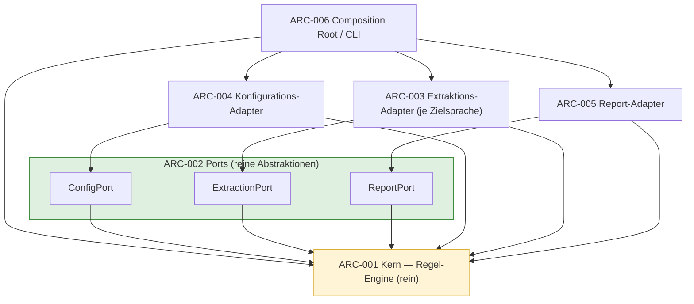
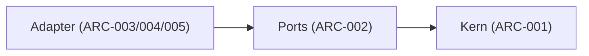
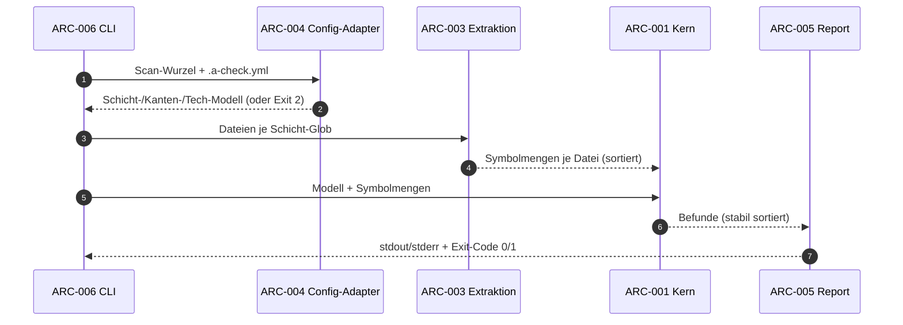

# Architektur — a-check

**Version:** 0.2.0

**Status:** Draft

**Stratum:** Sicht (derivativ; **keine eigenen Anforderungen**)

**Datum:** 2026-06-21.

---

## 1. Einordnung

Dieses Dokument ist das **Sicht-Stratum**: es *visualisiert* die
Komponenten und Rollen, die das [Lastenheft](lastenheft.md) (Vertrag) und
die [Spezifikation](spezifikation.md) (Technik) festlegen — es trägt
**keine eigenen Anforderungen** und ist **sprach- und meilensteinfrei**
(es benennt Schichten/Rollen, nicht Technologie oder Wellen). `ARC-<NNN>`
benennen *Struktur* (Komponenten, Schnittstellen), keine Anforderungen.

`a-check` ist selbst **hexagonal** geschnitten — es erzwingt in fremden
Repos genau die Schichtung, der es auch selbst folgt (Dogfooding,
[AC-QA-02](lastenheft.md#ac-qa-02--hermetik-und-ehrliche-heuristik-grenze)).

## 2. Komponenten

| Kennung | Komponente | Rolle |
|---|---|---|
| **ARC-001** | Kern (Regel-Engine) | wertet die sechs Regeln auf einem abstrakten Import-/Schicht-Modell aus ([SPEC-RULE-001](spezifikation.md#spec-rule-001--regel-auswertung)); **rein** — keine I/O, kein Tech, keine Zielsprach-Kenntnis. |
| **ARC-002** | Ports | reine Abstraktionen `ConfigPort` / `ExtractionPort` / `ReportPort`: sie **referenzieren Domänentypen** des Kerns (die Sprache des Kerns), importieren aber **keinen Adapter und kein Tech**. a-check führt sie als **eigene `ports`-Schicht** mit deklarierter `{from: ports, to: core}`-Kante (Eigen-[`.a-check.yml`](../.a-check.yml)). Ein Projekt mit reinen Ports (eigene DTOs, importiert nichts) lässt die Kante weg. |
| **ARC-003** | Extraktions-Adapter (je Zielsprache) | implementieren `ExtractionPort` text-heuristisch ([SPEC-EXTRACT-001](spezifikation.md#spec-extract-001--import-extraktion)); je ein Adapter pro **Zielsprache** (C++/Go/Rust/Kotlin — Problemdomäne, nicht Implementierungstechnik). |
| **ARC-004** | Konfigurations-Adapter | lädt und dekodiert `.a-check.yml` strikt ([SPEC-CONF-001](spezifikation.md#spec-conf-001--konfigurationsschema)); implementiert `ConfigPort`. |
| **ARC-005** | Report-Adapter | formatiert Befunde und Zusammenfassung und bestimmt den **Befund-Exit-Code** (`0`/`1`, [SPEC-CLI-001](spezifikation.md#spec-cli-001--aufruf-scan-wurzel-und-exit-codes)); implementiert `ReportPort`. |
| **ARC-006** | Composition Root / CLI | parst Flags, verdrahtet Adapter an den Kern, bedient `--print-config`/`--print-mk` ([SPEC-DIST-001](spezifikation.md#spec-dist-001--laufzeitform-und-distribution)) und meldet den **Nutzungs-/Konfigurationsfehler-Exit-Code** (`2`). Nicht zu verwechseln mit dem Config-Schlüssel `composition_root` des *geprüften* Repos ([SPEC-CONF-001](spezifikation.md#spec-conf-001--konfigurationsschema)). |

## 3. Schicht-Richtung (Zugriffs-Constraints)

- Der **Kern** importiert nichts nach außen (weder Ports-Implementierungen
  noch Adapter noch Tech).
- **Ports** sind reine Abstraktionen: sie referenzieren Domänentypen des Kerns, importieren aber keinen Adapter und kein Tech.
- **Adapter** hängen von Ports und Domänentypen des Kerns ab, nie voneinander
  (außer der konfigurierten gemeinsamen Senke).
- Nur die **Composition Root** (ARC-006) verdrahtet konkrete Adapter an die
  Ports.

Dies ist dieselbe Richtung `core ← ports ← adapters`, die `a-check` in
fremden Repos prüft — die Eigen-Architektur ist damit über das Tool selbst
nachweisbar (Dogfooding,
[AC-QA-02](lastenheft.md#ac-qa-02--hermetik-und-ehrliche-heuristik-grenze)).

## 4. Sequenz: ein Scan-Lauf

## 5. Geltung der Constraints

Die Zugriffs-Constraints aus §3 sind maschinell prüfbar (Eigen-`arch-check`,
Dogfooding) und spiegeln die Regel-Semantik aus
[SPEC-RULE-001](spezifikation.md#spec-rule-001--regel-auswertung): Kern-Reinheit,
Port-Disziplin und Schicht-Richtung gelten für `a-check` selbst wie für die
geprüften Repos.

## 6. Historie

| Version | Datum | Änderung |
|---|---|---|
| 0.1.0 | 2026-06-21 | Erstfassung (Sicht-Stratum): Hexagon-Komponenten `ARC-001…006` (Kern/Ports/Extraktions-/Config-/Report-Adapter/Composition Root), Schicht-Richtung und Scan-Sequenz; sprach-/meilensteinfrei, visualisiert Lastenheft + Spezifikation. |
| 0.2.0 | 2026-06-22 | ARC-002 nachgezogen: Ports sind eigene `ports`-Schicht, die Domänentypen referenziert (statt Co-Location im Kern-Paket); §2-Abhängigkeitsrichtung Ports→Kern korrigiert. |
