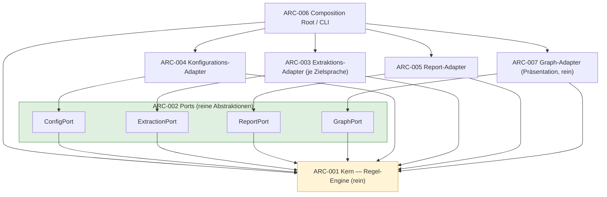
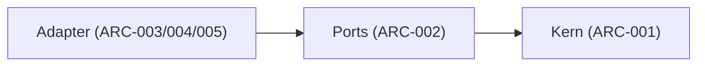
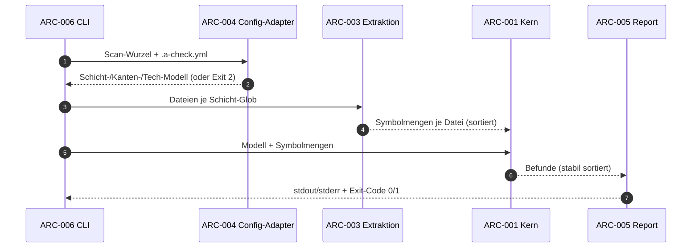
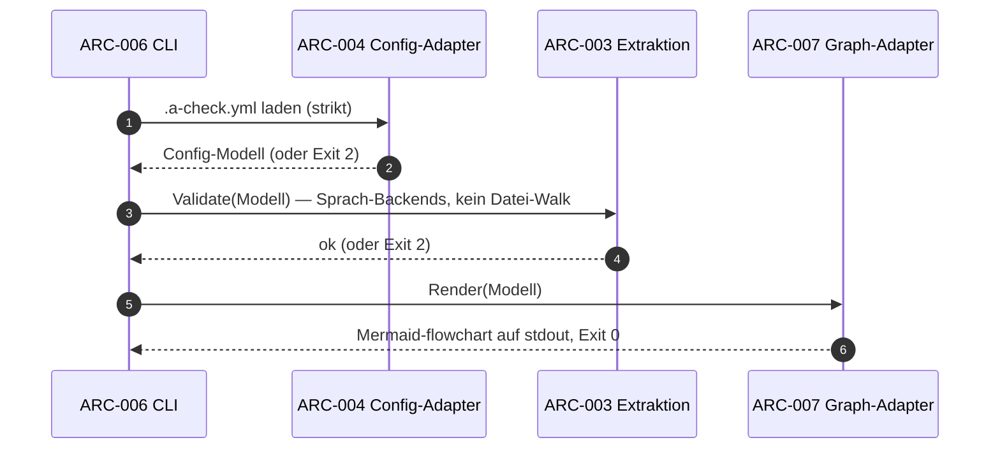

# Architektur — a-check

**Version:** 0.4.0

**Status:** Draft

**Stratum:** Sicht (derivativ; **keine eigenen Anforderungen**)

**Datum:** 2026-06-21.

---

## 1. Einordnung

Dieses Dokument ist das **Sicht-Stratum**: es *visualisiert* die
Komponenten und Rollen, die das [Lastenheft](lastenheft.md) (Vertrag) und
die [Spezifikation](spezifikation.md) (Technik) festlegen — es trägt
**keine eigenen Anforderungen** und ist **sprach- und meilensteinfrei**
(es benennt Schichten/Rollen, nicht Technologie oder Wellen). `ARC-<NNN>`
benennen *Struktur* (Komponenten, Schnittstellen), keine Anforderungen.

`a-check` ist selbst **hexagonal** geschnitten — es erzwingt in fremden
Repos genau die Schichtung, der es auch selbst folgt (Dogfooding,
[AC-QA-02](lastenheft.md#ac-qa-02--hermetik-und-ehrliche-heuristik-grenze)).

## 2. Komponenten

Regeln dieser Sektion: **Hier werden die `ARC-*` für Komponenten vergeben** — eine Zeile je
Kasten des Diagramms, damit es *eine* Stelle gibt. Die Kennung ist eine Adresse, damit ein Slice
sagen kann, welche Komponente er berührt; sie ist **keine** Anforderung. Gezählt wird fortlaufend
je Datei, nicht je Sektion (Baseline-Regelwerk `grundlagen-source-precedence.md` §ID-Schema als
Klammer, §Vergabe).

```mermaid
flowchart TD
    CLI["ARC-006 Composition Root / CLI"]
    CFG["ARC-004 Konfigurations-Adapter"]
    EXT["ARC-003 Extraktions-Adapter (je Zielsprache)"]
    REP["ARC-005 Report-Adapter"]
    GRAPH["ARC-007 Graph-Adapter (Präsentation, rein)"]
    subgraph Ports["ARC-002 Ports (reine Abstraktionen)"]
        CP["ConfigPort"]
        EP["ExtractionPort"]
        RP["ReportPort"]
        GP["GraphPort"]
    end
    CORE["ARC-001 Kern — Regel-Engine (rein)"]

    CLI --> CFG --> CP
    CLI --> EXT --> EP
    CLI --> GRAPH --> GP
    CLI --> CORE
    CP --> CORE
    EP --> CORE
    RP --> CORE
    GP --> CORE
    CFG --> CORE
    EXT --> CORE
    REP --> CORE
    GRAPH --> CORE
    REP --> RP
    CLI --> REP
    style CORE fill:#fff4d6,stroke:#d4a017
    style Ports fill:#e0f0e0,stroke:#3a8a3a
```

| Kennung | Komponente | Rolle |
|---|---|---|
| **ARC-001** | Kern (Regel-Engine) | wertet die sieben Regeln auf einem abstrakten Import-/Schicht-Modell aus ([SPEC-RULE-001](spezifikation.md#spec-rule-001--regel-auswertung)); **rein** — keine I/O, kein Tech, keine Zielsprach-Kenntnis. |
| **ARC-002** | Ports | reine Abstraktionen `ConfigPort` / `ExtractionPort` / `ReportPort` / `GraphPort`: sie **referenzieren Domänentypen** des Kerns (die Sprache des Kerns), importieren aber **keinen Adapter und kein Tech**. a-check führt sie als **eigene `ports`-Schicht** mit deklarierter `{from: ports, to: core}`-Kante (Eigen-[`.a-check.yml`](../.a-check.yml)). Ein Projekt mit reinen Ports (eigene DTOs, importiert nichts) lässt die Kante weg. |
| **ARC-003** | Extraktions-Adapter (je Zielsprache) | implementieren `ExtractionPort` text-heuristisch ([SPEC-EXTRACT-001](spezifikation.md#spec-extract-001--import-extraktion)); je ein Adapter pro **Zielsprache** (C++/Go/Rust/Kotlin/Java/Python/C#/TypeScript — Problemdomäne, nicht Implementierungstechnik). `ExtractionPort` bietet neben `Extract` (Datei-Walk) einen **validation-only** `Validate`-Einstieg, der die Sprach-Backends **ohne** Walk prüft — genutzt vom no-scan-`--print-graph`-Pfad ([SPEC-CLI-002](spezifikation.md#spec-cli-002--graph-renderer-vertrag)); `Extract` ruft denselben Check intern. |
| **ARC-004** | Konfigurations-Adapter | lädt und dekodiert `.a-check.yml` strikt ([SPEC-CONF-001](spezifikation.md#spec-conf-001--konfigurationsschema)); implementiert `ConfigPort`. |
| **ARC-005** | Report-Adapter | formatiert Befunde und Zusammenfassung und bestimmt den **Befund-Exit-Code** (`0`/`1`, [SPEC-CLI-001](spezifikation.md#spec-cli-001--aufruf-scan-wurzel-und-exit-codes)); implementiert `ReportPort`. |
| **ARC-006** | Composition Root / CLI | parst Flags, verdrahtet Adapter an den Kern, bedient `--print-config`/`--print-mk` ([SPEC-DIST-001](spezifikation.md#spec-dist-001--laufzeitform-und-distribution)) und `--print-graph` (no-scan-Graph-Ausgabe: `Config.Load → Extraktion.Validate → GraphPort.Render → stdout`, [SPEC-CLI-002](spezifikation.md#spec-cli-002--graph-renderer-vertrag)) und meldet den **Nutzungs-/Konfigurationsfehler-Exit-Code** (`2`). Nicht zu verwechseln mit dem Config-Schlüssel `composition_root` des *geprüften* Repos ([SPEC-CONF-001](spezifikation.md#spec-conf-001--konfigurationsschema)). |
| **ARC-007** | Graph-Adapter (Präsentation) | implementiert `GraphPort`; bildet das Config-Modell **pur** (kein I/O) auf ein Mermaid-`flowchart` ab ([SPEC-CLI-002](spezifikation.md#spec-cli-002--graph-renderer-vertrag)) — stabile interne Knoten-IDs + escapte Labels, `edges`/`allow`-Kanten, effektive Rollen-Farbe (geteilter Kern-Resolver), `direction`-Subgraphs, isolierte Sonderknoten für `composition_root`/`adapter_sink`; von der Composition Root (ARC-006) für `--print-graph` verdrahtet, read-only. |

## 3. Schicht-Richtung (Zugriffs-Constraints)

Regeln dieser Sektion: Welche ADR eine Layering-Regel verbindlich macht, deklariert die ADR
aufwärts in ihrem `Schärft:`-Feld — **kein ADR-Bezug in dieser Sicht** (Baseline-Regelwerk
`grundlagen-referenz-richtung.md` §Referenz-Richtung (SDP)).

```mermaid
flowchart LR
    A["Adapter (ARC-003/004/005)"] --> P["Ports (ARC-002)"] --> K["Kern (ARC-001)"]
```

- Der **Kern** importiert nichts nach außen (weder Ports-Implementierungen
  noch Adapter noch Tech).
- **Ports** sind reine Abstraktionen: sie referenzieren Domänentypen des Kerns, importieren aber keinen Adapter und kein Tech.
- **Adapter** hängen von Ports und Domänentypen des Kerns ab, nie voneinander
  (außer der konfigurierten gemeinsamen Senke).
- Nur die **Composition Root** (ARC-006) verdrahtet konkrete Adapter an die
  Ports.

Dies ist dieselbe Richtung `core ← ports ← adapters`, die `a-check` in
fremden Repos prüft — die Eigen-Architektur ist damit über das Tool selbst
nachweisbar (Dogfooding,
[AC-QA-02](lastenheft.md#ac-qa-02--hermetik-und-ehrliche-heuristik-grenze)).

## 4. Externe Abhängigkeiten

Regeln dieser Sektion: Auch die Schnittstelle zu einem externen System trägt eine `ARC-*` — die
Kennung benennt den *Berührungspunkt*, nicht das fremde System.

`a-check` läuft selbst **hermetisch** — netzlos (`--network none`), keine Laufzeit-Abhängigkeit
zu einem externen Dienst ([AC-QA-02](lastenheft.md#ac-qa-02--hermetik-und-ehrliche-heuristik-grenze)).
Externe Systeme berühren nur den **Distributions**-Weg, nie den Scan-Lauf selbst.

| ID | System | Rolle | Substituierbarkeit |
|---|---|---|---|
| **ARC-008** | GHCR (`ghcr.io`) | primäre Registry — Image-Distribution, digest-gepinnt ([SPEC-DIST-001](spezifikation.md#spec-dist-001--laufzeitform-und-distribution)) | austauschbar (jede OCI-Registry); die Pin-Mechanik bindet an den Digest, nicht an die Registry-Identität |
| **ARC-009** | Docker Hub | Spiegel des GHCR-Images ([AC-FA-DIST-002](lastenheft.md#ac-fa-dist-002)) | optional — kein Laufzeit-Bezug, reiner Zweit-Kanal |

## 5. Sequenz: ein Scan-Lauf

```mermaid
sequenceDiagram
    autonumber
    participant CLI as ARC-006 CLI
    participant CFG as ARC-004 Config-Adapter
    participant EXT as ARC-003 Extraktion
    participant CORE as ARC-001 Kern
    participant REP as ARC-005 Report

    CLI->>CFG: Scan-Wurzel + .a-check.yml
    CFG-->>CLI: Schicht-/Kanten-/Tech-Modell (oder Exit 2)
    CLI->>EXT: Dateien je Schicht-Glob
    EXT-->>CORE: Symbolmengen je Datei (sortiert)
    CLI->>CORE: Modell + Symbolmengen
    CORE-->>REP: Befunde (stabil sortiert)
    REP-->>CLI: stdout/stderr + Exit-Code 0/1
```

Der **no-scan-Pfad** `--print-graph`
([SPEC-CLI-002](spezifikation.md#spec-cli-002--graph-renderer-vertrag)) liest **nur**
die Config und rendert, **ohne** Quellen zu scannen:

```mermaid
sequenceDiagram
    autonumber
    participant CLI as ARC-006 CLI
    participant CFG as ARC-004 Config-Adapter
    participant EXT as ARC-003 Extraktion
    participant GRAPH as ARC-007 Graph-Adapter

    CLI->>CFG: .a-check.yml laden (strikt)
    CFG-->>CLI: Config-Modell (oder Exit 2)
    CLI->>EXT: Validate(Modell) — Sprach-Backends, kein Datei-Walk
    EXT-->>CLI: ok (oder Exit 2)
    CLI->>GRAPH: Render(Modell)
    GRAPH-->>CLI: Mermaid-flowchart auf stdout, Exit 0
```

## 6. Fehlermodelle und Resilienz

Regeln dieser Sektion: Fehlerbehandlung ist Bestandteil der Sicht, weil sie zeigt, **welche
Schicht** einen Fehlerfall zuerst sieht — Details des Exit-Code-Vertrags trägt
[AC-FA-CLI-001](lastenheft.md#ac-fa-cli-001--aufruf-scan-wurzel-und-exit-codes).

| Fehlerquelle | Behandlung-Schicht | Ausgabe |
|---|---|---|
| Fehlende/ungültige `.a-check.yml` | ARC-004 Konfigurations-Adapter → ARC-006 Composition Root meldet Exit 2 | stderr, mit Zeilenangabe wo die Fehlerquelle eine Zeile hat |
| Unbekanntes Flag/Restargument | ARC-006 Composition Root | stderr, Exit 2 |
| Architektur-Befund (Regelverstoß) | ARC-001 Kern wertet aus, ARC-005 Report-Adapter formatiert | Befunde auf stdout, Zusammenfassung auf stderr, Exit 1 |
| Kein Befund | ARC-005 Report-Adapter | Zusammenfassung auf stderr, Exit 0 |

**Resilienz-Grenze:** `a-check` fängt keinen Fehler ab, um weiterzulaufen — jeder der drei
Exit-Codes ist terminal für den Lauf (kein Teilergebnis, kein Retry). Das ist bewusst: ein
Architektur-Gate, das bei einem Konfigurationsfehler "so gut es geht" weiterprüft, wäre
still-falsch-grün für den nicht geprüften Rest ([AC-QA-02](lastenheft.md#ac-qa-02--hermetik-und-ehrliche-heuristik-grenze)).

## 7. Geltung der Constraints

Die Zugriffs-Constraints aus §3 sind maschinell prüfbar (Eigen-`arch-check`,
Dogfooding) und spiegeln die Regel-Semantik aus
[SPEC-RULE-001](spezifikation.md#spec-rule-001--regel-auswertung): Kern-Reinheit,
Port-Disziplin und Schicht-Richtung gelten für `a-check` selbst wie für die
geprüften Repos.

## 8. Historie

| Version | Datum | Änderung |
|---|---|---|
| 0.1.0 | 2026-06-21 | Erstfassung (Sicht-Stratum): Hexagon-Komponenten `ARC-001…006` (Kern/Ports/Extraktions-/Config-/Report-Adapter/Composition Root), Schicht-Richtung und Scan-Sequenz; sprach-/meilensteinfrei, visualisiert Lastenheft + Spezifikation. |
| 0.2.0 | 2026-06-22 | ARC-002 nachgezogen: Ports sind eigene `ports`-Schicht, die Domänentypen referenziert (statt Co-Location im Kern-Paket); §2-Abhängigkeitsrichtung Ports→Kern korrigiert. |
| 0.3.0 | 2026-07-09 | Graph-Ausgabe additiv eingeordnet: neues **ARC-007** (Graph-Präsentationsadapter, pur, implementiert `GraphPort`); **ARC-002** um `GraphPort` ergänzt; **ARC-003** um den validation-only `Validate`-Einstieg (Sprach-Backends ohne Walk); **ARC-006** bedient zusätzlich `--print-graph`; §4 um die no-scan-Sequenz (`Config.Load → Extraktion.Validate → GraphPort.Render → stdout`) erweitert. Sprach-/meilensteinfrei; visualisiert [SPEC-CLI-002](spezifikation.md#spec-cli-002--graph-renderer-vertrag). |
| 0.4.0 | 2026-09-05 | Zwei gegen die v6.0.0-Baseline-Ziel-Form nachgezogene Abschnitte: neues **§4 Externe Abhängigkeiten** (**ARC-008** GHCR, **ARC-009** Docker-Hub-Spiegel — beide reine Distributions-Berührungspunkte, kein Laufzeit-Bezug) und neues **§6 Fehlermodelle und Resilienz** (Exit-Code-Vertrag aus [AC-FA-CLI-001](lastenheft.md#ac-fa-cli-001--aufruf-scan-wurzel-und-exit-codes) je Behandlung-Schicht aufgeschlüsselt). Folge-Sektionen §5/§7/§8 rücken nach; kein Cross-Referenz-Bruch (nur §2 ist von außen zitiert, unverändert). Kein neuer Fakt — beide Abschnitte fassen bereits an anderer Stelle belegte Aussagen an der von der Ziel-Form vorgesehenen Stelle zusammen. |
